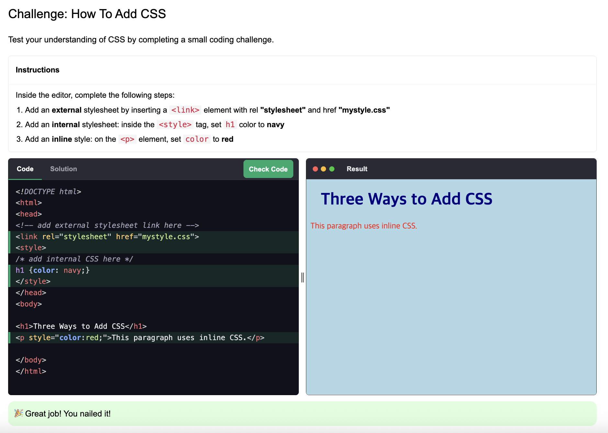
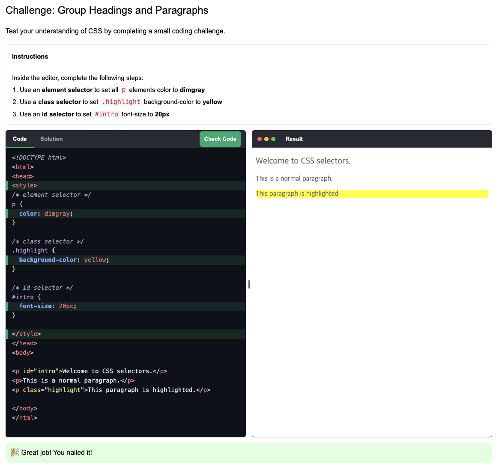
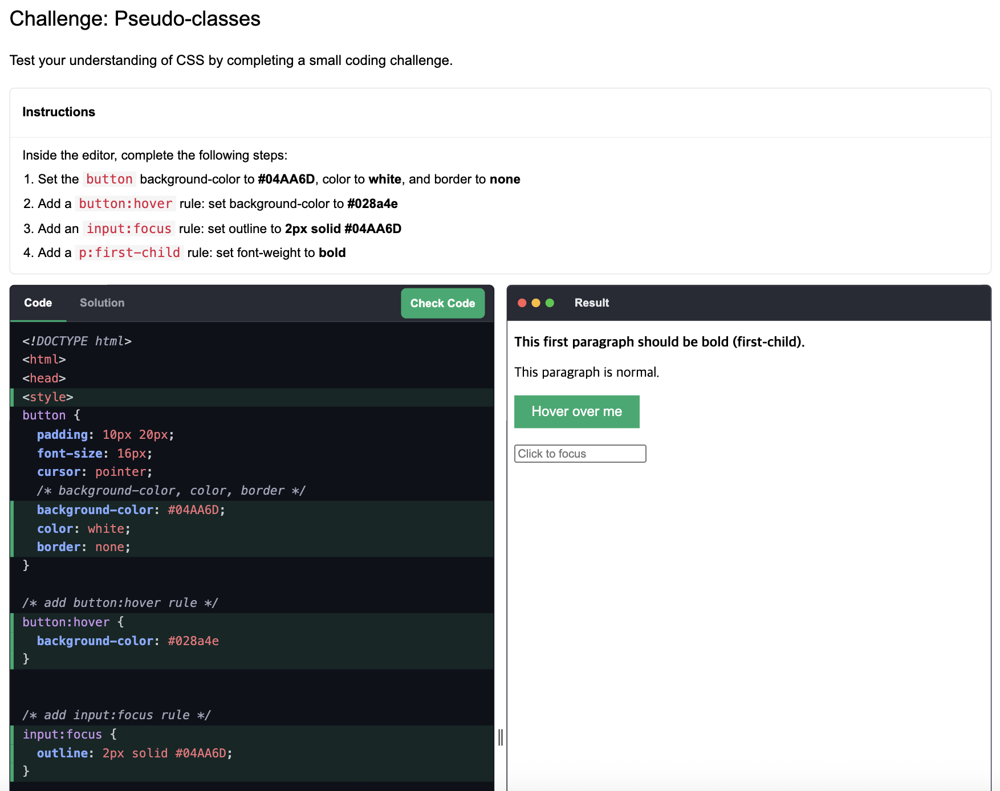
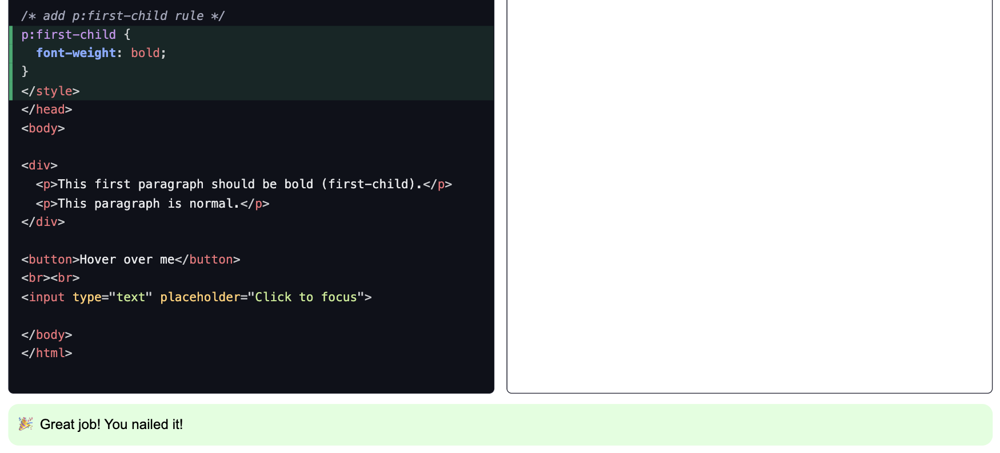
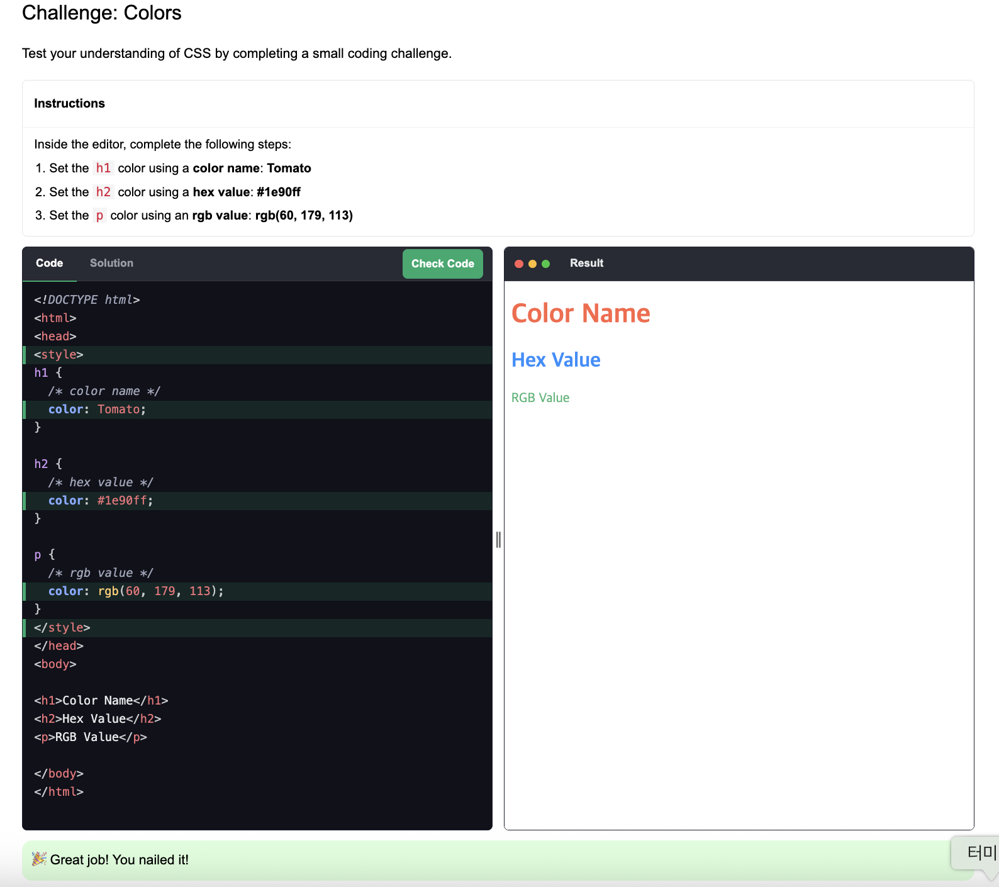
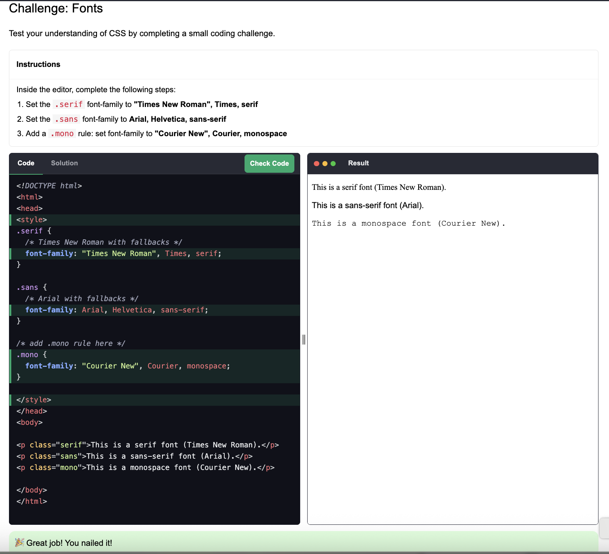
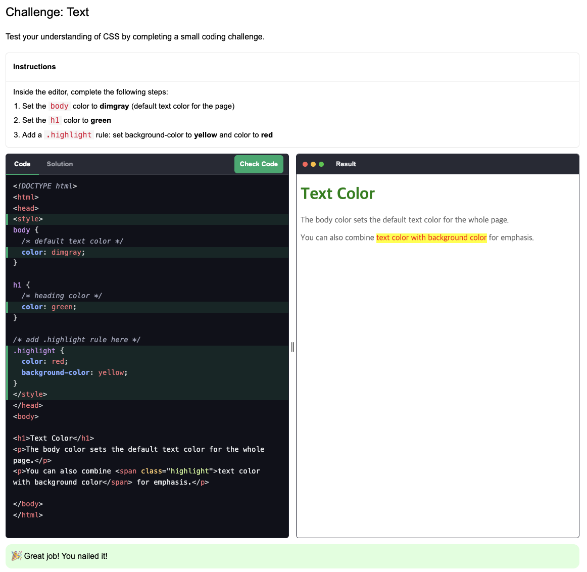
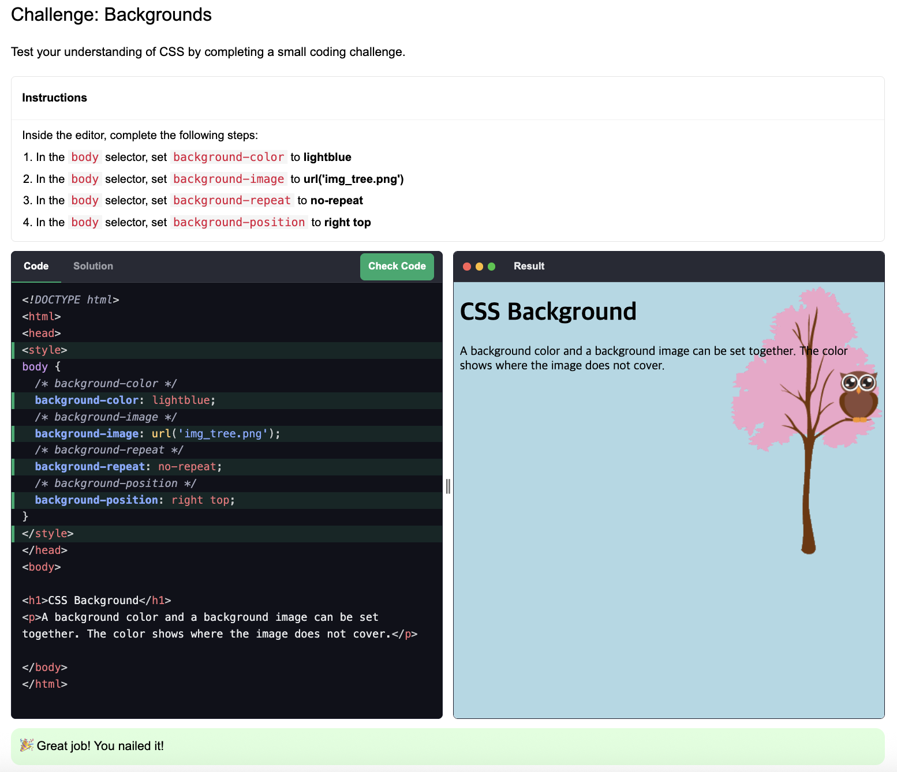
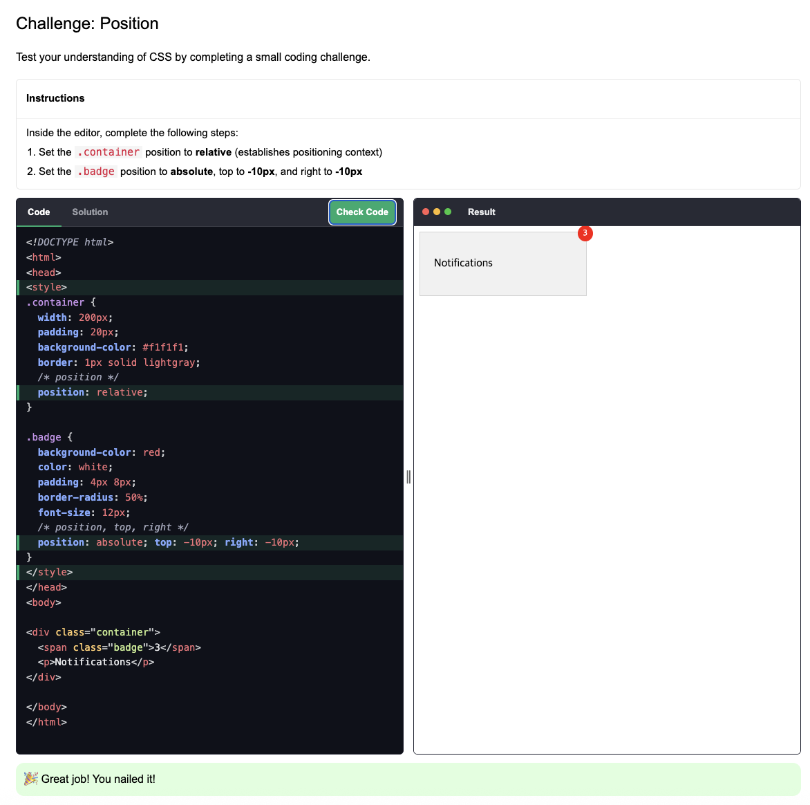
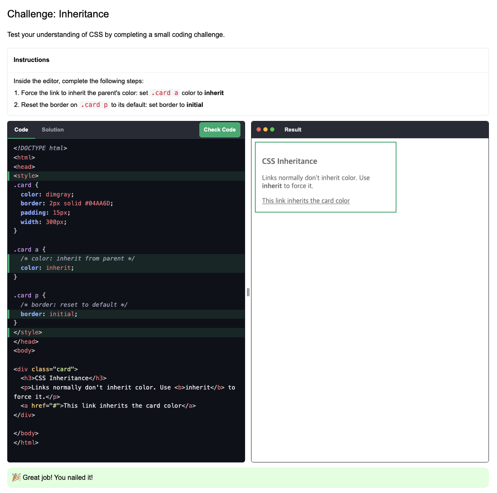

# CSS Code Challenge

다음 실습을 진행했습니다.

1. CSS How To - https://www.w3schools.com/css/css_challenges_howto.asp

    

2. CSS Selectors - https://www.w3schools.com/css/css_challenges_selectors.asp

    

3. CSS Pseudo-classes - https://www.w3schools.com/css/css_challenges_pseudo_classes.asp

        
    

---

1. CSS Colors - https://www.w3schools.com/css/css_challenges_colors.asp
    

2. CSS Fonts - https://www.w3schools.com/css/css_challenges_font.asp
    

3. CSS Text - https://www.w3schools.com/css/css_challenges_text.asp
    
   
4. CSS Backgrounds - https://www.w3schools.com/css/css_challenges_background.asp
    
      - 한 번에 'Great job!'이 안 떠서 보니까 `background`를 `backgound`라고 썼습니다.
      - 철자를 꼼꼼하게 확인해야겠다는 다짐을 했습니다.

5. CSS Position - https://www.w3schools.com/css/css_challenges_position.asp
    

6. CSS Inheritance - https://www.w3schools.com/css/css_challenges_inheritance.asp
    