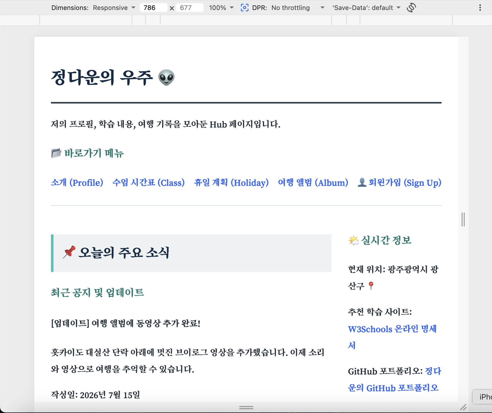
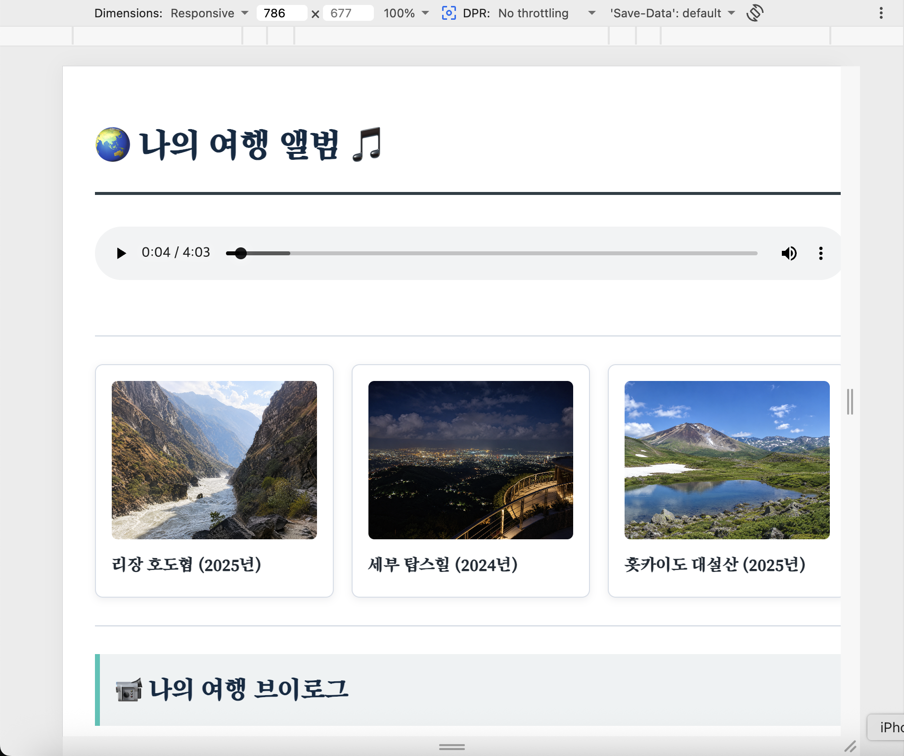
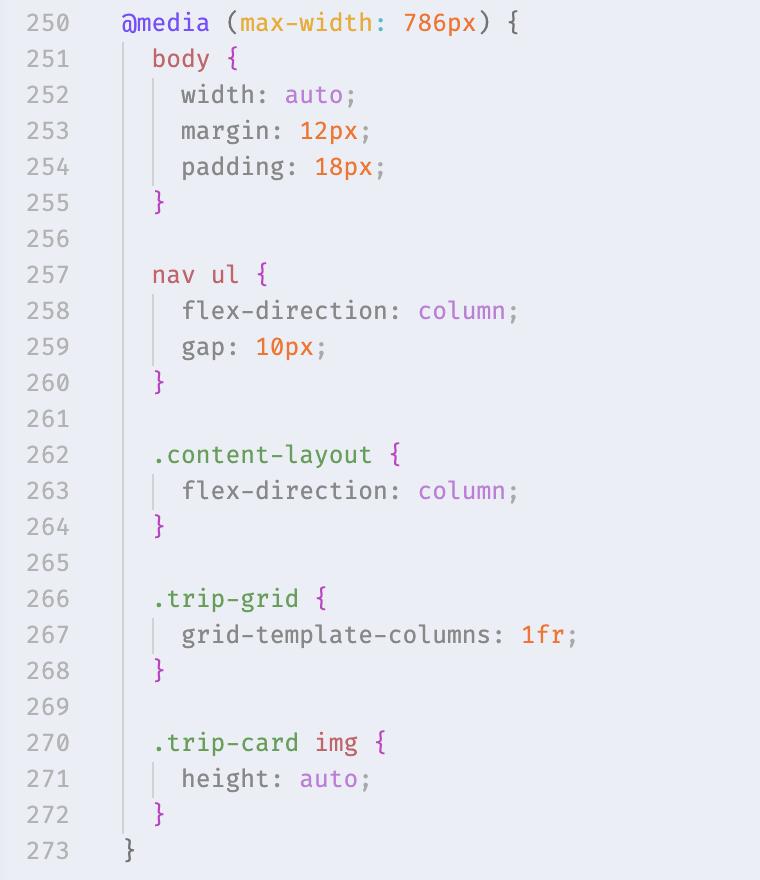
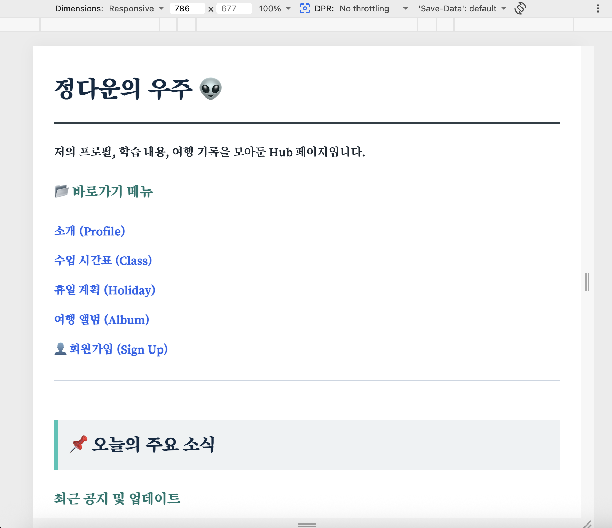
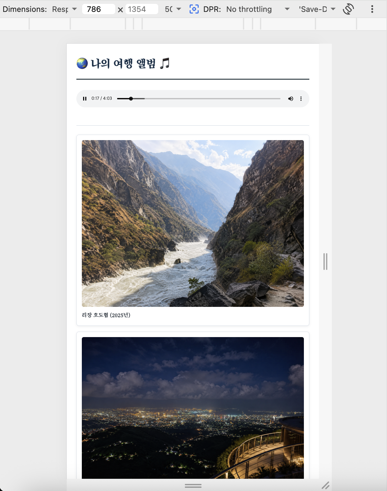

# [실습] 미션 5 - 스마트폰에서 보기 (반응형 웹 디자인)

🗓️ 수행 날짜 : 2026-07-16    
👤 작성자 : 4기 광주 3반 정다운    
📚 수행 내용  
- 개념 : 레이아웃이 화면이 작은 모바일 기기에서도 꺠지지 않고 유연하게 변하도록 함
- 실습
  1. Index.html : 화면 폭이 786 px 이하로 줄면 본문|사이드바 구조를 세로 1열로 변경하고 바로가기로 1열로 정렬
  2. myTrip.html : 3열 배열을 1열로 조정

## Before

화면 폭을 786px로 설정했을 때 모습입니다.    
반응형 웹 디자인을 적용하지 않아 가독성이 떨어지는 걸 확인할 수 있습니다.    

### index.html

### myTrip.html

## Doing

`css/style.css`의 맨 아래에 `@media`를 추가하여 화면 너비가 786px 이하일 때만 `nav ul`, `.content-layout`, `.trip-grid`에 대한 반응형 규칙을 추가하여 1열로 정렬되도록 조정하였습니다.

## After

### index.html

### myTrip.html
