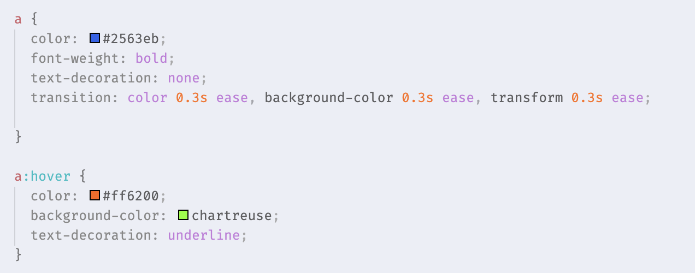
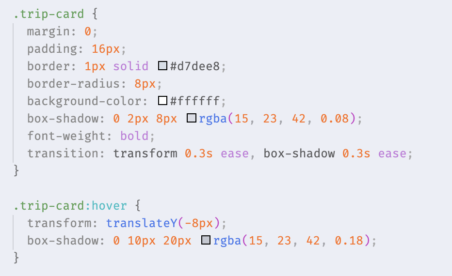
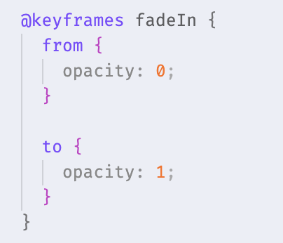
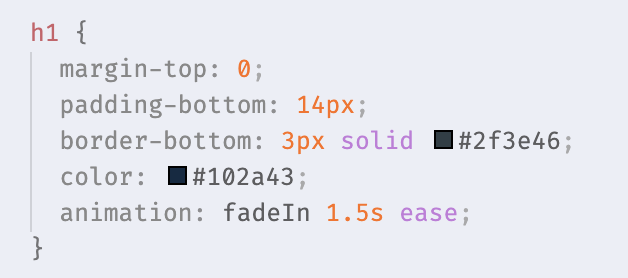

# [실습] 미션 6 - 생동감을 불어넣는 애니메이션 

🗓️ 수행 날짜 : 2026-07-16    
👤 작성자 : 4기 광주 3반 정다운    
📚 수행 내용  
- 개념 : 사용자의 마우스 움직임에 반응하고, 화면이 살아 숨 쉬는 듯한 부드러운 효과를 추가
- 실습
  1. 내비게이션 메뉴나 회원가입 버튼에 마우스를 올렸을 때 배경색이나 글자색이 순식간에 바뀌지 않고 부드럽게 변하도록 처리
  2. 여행 앨범의 카드에 마우스를 올리면 박스가 살짝 위로 떠 오르고 그림자가 더 진해지는 효과를 주어 '클릭하고 싶게' 만든다.
  3. index.html을 처음 열었을 때, 상단 헤더의 타이틀이 부드럽게 페이드인 되며 나타나는 등장 애니메이션을 구현

## Before

index.html을 처음 열었을 때 타이틀에 애니메이션 효과가 없고, 메뉴 버튼에 마우스를 올려도 전혀 반응하지 않는 모습입니다.    
여행 앨범의 카드에 마우스를 올려도 아무런 반응이 없습니다.   

## Doing

1. 버튼 hover 부드럽게
  - 기존 a에 transition을 추가하여 hover시 색상 변화가 부드럽게 이루어지도록 했습니다.    
    

2. 여행 카드 hover 효과
  - `class="trip-card"`에 대해 transition을 추가하여 hover시 카드가 위로 8px 올라가고 그림자 효과가 생기도록 했습니다.    
    

3. 제목 등장 애니메이션
  - 처음 페이지를 열었을 때 h1이 서서히 나타나게 하도록 `@keyframes fadeIn`을 정의하고 이를 h1에 적용하여 fade in 효과를 주었습니다.
    
    

## After

