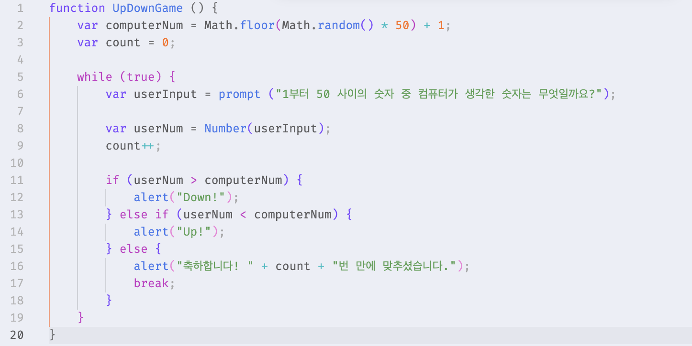
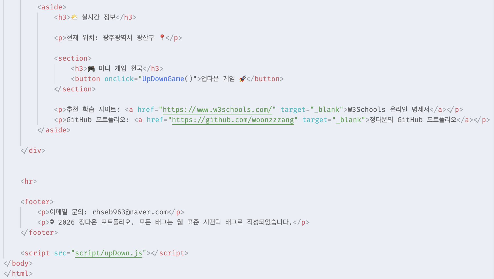
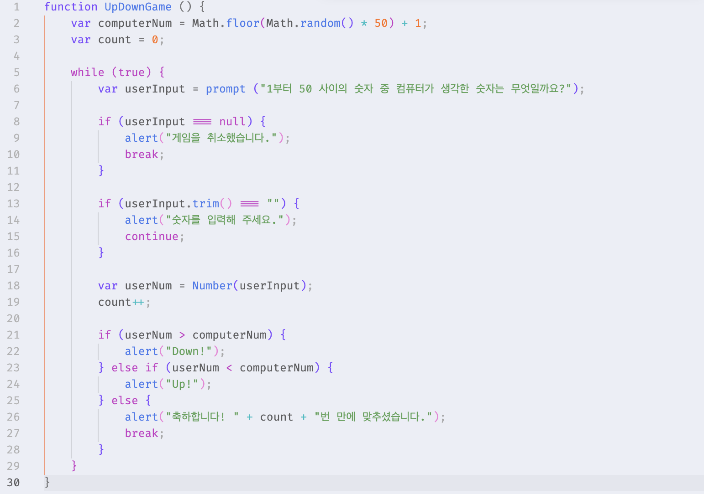

# [과제] Up-Down 숫자 맞히기 게임 

🗓️ 수행 날짜 : 2026-07-17    
👤 작성자 : 4기 광주 3반 정다운    
📚 수행 내용  
- 컴퓨터가 생각한 비밀 숫자를 사용자가 맞히는 게임을 만든다. (/script/upDown.js)
  - 컴퓨터가 1부터 50 사이의 무작위 숫자 하나를 생성하게 한다. (var computerNum = Math.floor(Math.random() * 50) + 1;)
  - prompt() 창을 띄워 사용자에게 숫자를 입력받는다.
  - 사용자가 맞출 때까지 반복해서 기회를 준다. (while 또는 for 반복문 실습)
  - 사용자가 정답보다 큰 값을 입력하면 alert("Down!"), 작은 값을 입력하면 alert("Up!")을 띄워준다.
  - 정답을 맞히면 alert("축하합니다! X번 만에 맞히셨습니다.")를 띄우고 게임을 종료한다.
- index.html 파일의 원하는 위치(예: <aside> 영역 안의 새로운 <section>)에 게임 시작 버튼 태그를 추가하여 실행

## Doing

1. `/script/upDown.js` 파일을 만들어 Up-Down 게임을 수행할 수 있는 코드를 작성했습니다.
   
   - `var computerNum = Math.floor(Math.random() * 50) + 1;`     
      : 1부터 50까지 숫자 중 무작위 1개 숫자 생성하여 computerNum에 저장    
   - `var userInput = prompt ("1부터 50 사이의 숫자 중 컴퓨터가 생각한 숫자는 무엇일까요?");`    
      : prompt() 창을 띄워 사용자에게 숫자 입력 받음      
   - 사용자가 맞힐 때까지 반복해서 기회를 주며, 정답보다 큰 값을 입력하면 Down! 작은 값을 입력하면 Up!을 띄우고 정답을 맞히면 메시지와 함께 게임 종료    

2. `index.html`의 `<aside>` 안에 `<section>`을 만들어 게임 시작 버튼 태그를 추가
   
   - 특히 `` 를 `<head>`가 아니라 `<body>` 제일 마지막 부분에 넣었습니다. 
   - 이유는 HTML 요소가 먼저 로딩되도록 하고 JS가 나중에 실행되어서 오류 가능성을 줄이고 화면이 더 빨리 표시되도록 하기 위함입니다. 
   - 브라우저가 `<head>` 안의 JS를 실행하는 순간에는 아직 아래쪽의 `<body>`를 읽기 전이기 때문에 필요한 버튼이 아직 만들어지기 전이므로 JS 코드에서 null 값이 발생해 오류가 발생할 수 있음 
   - 따라서 `<body>`의 마지막 부분에 작성하거나 `<head>`에 작성한다면 src 뒤에 `defer`를 추가하면 HTML을 먼저 다 읽고 JS를 실행한다는 걸 배웠습니다.

## 문제 상황

    

취소나 확인을 눌러도 꺼지지 않고 Up!이 뜨는 문제 발생   
- 원인 : 취소를 누르면 input에 null이 들어가고 확인을 누르면 ""이 들어가는데 둘 다 0으로 처리되어 정답 숫자보다 작기 때문에 Up이 표시됨 

## 해결

취소를 눌렀을 때 (userInput === null)와 공백일 때 (userInput.trim() === "")를 고려한 예외처리 코드를 넣었습니다.

## 최종 결과

1. "  " 또는 "" 인 경우 숫자를 입력해 달라는 문구 표시
2. '취소' 선택 시 게임을 취소했다는 문구 표시
3. Up-Down 숫자 맞히기 게임 진행 후 정답을 맞히면 몇 번 만에 맞혔는지 표시 