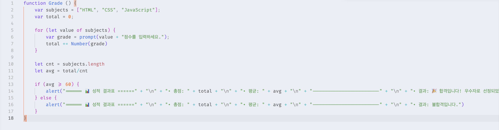

# [과제] 성적 계산기

🗓️ 수행 날짜 : 2026-07-17    
👤 작성자 : 4기 광주 3반 정다운    
📚 수행 내용  
- 강의 3과목의 점수를 연속으로 입력받아 평균을 내고 합격 여부와 등급을 정한다. (/script/grade.js)
  - 과목 이름이 담긴 배열을 미리 만들어 둡니다. var subjects = [“HTML", “CSS", “JavaScript"];
  - 총점을 저장할 변수(var total = 0;)를 만듭니다.
  - for문을 배열의 길이만큼 돌리면서, 각 과목의 점수를 prompt()로 연속해서 입력받아 total에 더합니다.
  - 예: prompt(subjects[i] + " 점수를 입력하세요.");
  - 반복문이 끝난 후 평균 점수를 구합니다. (평균 점수가 60점 이상이면 합격, 60점 미만이면 불합격)
  - 결과를 브라우저 alert창으로 보여줍니다. (alert("총점: 240점, 평균: 80, 결과: 합격입니다!")

## Doing

`/script/grade.js` 파일을 만들어 성적을 계산할 수 있도록 코드를 작성했습니다.

   
## 배운 점
- prompt로 받은 값은 문자열 → 상황에 따라 변환 필요 
   
  - 처음에 `total += grade`로 코드를 작성했는데 결과가 이상하여 숫자로 변환이 필요함을 배웠습니다.
  - 예를들어 50 + 60 + 60 이 170이 아니라 0506060 으로 총점이 저장되는데 총점은 또 정수로 저장이 되는지 평균 점수는 계산이 되는 점이 신기했습니다. 
  - 이유는 `/`는 문자열 연결 기능이 없고 나눗셈만 수행하기 때문에 JavaScript가 문자열 "0506060"을 숫자 506060으로 자동 변환하여 나눗셈이 계산된다는 걸 배웠습니다.
  - 자칫 위험한 상황으로 이어질 수 있기 때문에 형식을 항상 잘 확인해야겠다는 생각을 했습니다. 

## 결과

