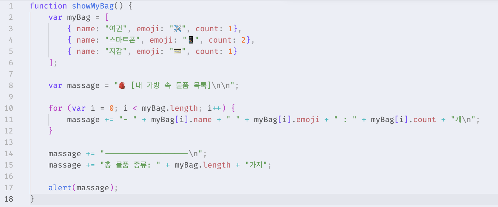
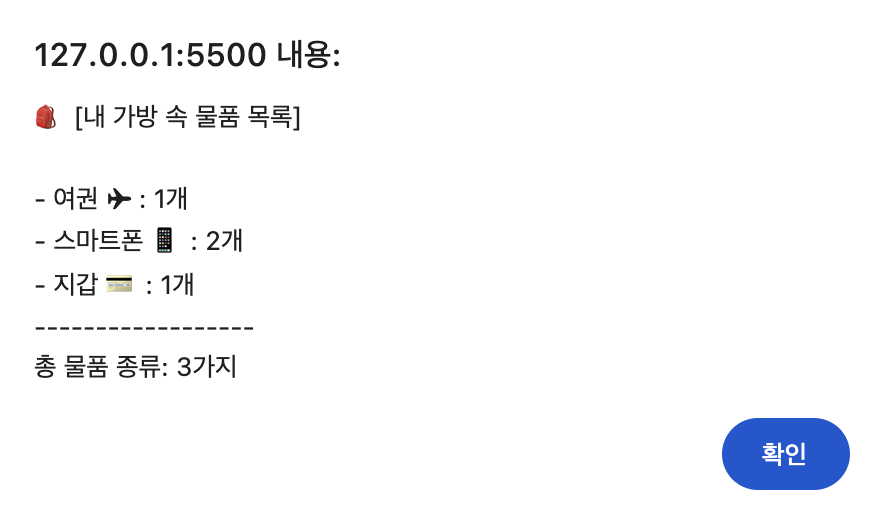

# [과제] 내 가방 보기

🗓️ 수행 날짜 : 2026-07-17    
👤 작성자 : 4기 광주 3반 정다운    
📚 수행 내용  
- 가방 속 물품을 JavaScript Object로 만들고 그 내용을 보여준다.
  - /script/bag.js를 만들고 그 안에 showMyBag()함수를 생성한다.
  - myBag이라는 배열에는 소지품 객체 (소지품 명과, 소지품 수)의 임의 데이터를 만든다.
  - 반복문을 통해 소지품 객체를 출력한다.

## Doing

`/script/bag.js` 파일을 만들어 가방 속 소비품을 확인할 수 있는 코드를 작성했습니다.

- for문을 이용해 배열에 담긴 물품 객체를 하나씩 꺼내서 alert에 보여줄 문자열을 만들었습니다. 
- JavaScript Object를 이용하면 하나의 대상이 가진 여러 정보를 한 덩어리로 묶어서 담을 수 있다는 걸 배웠습니다.

## 결과

