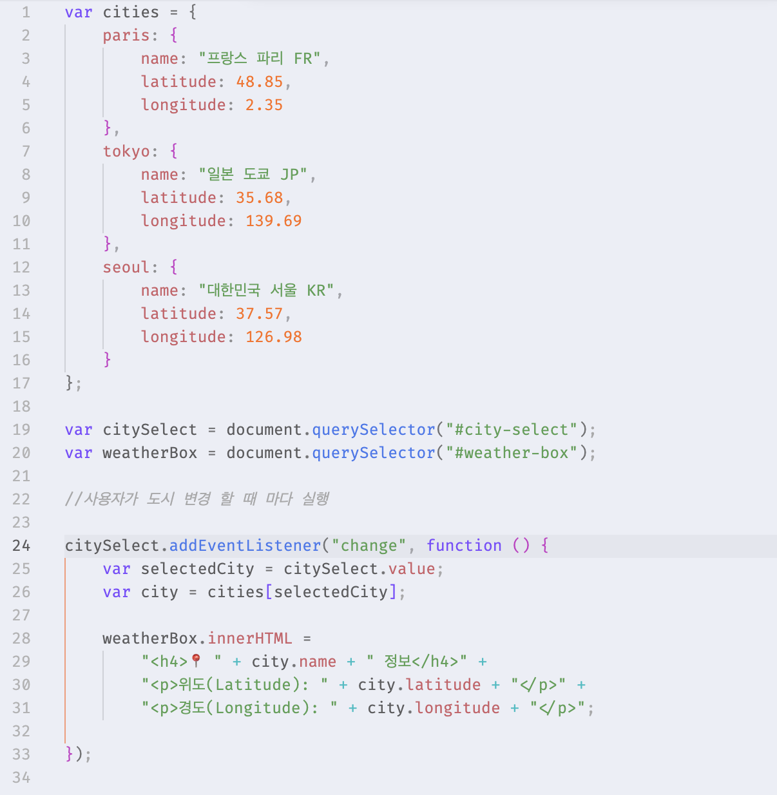
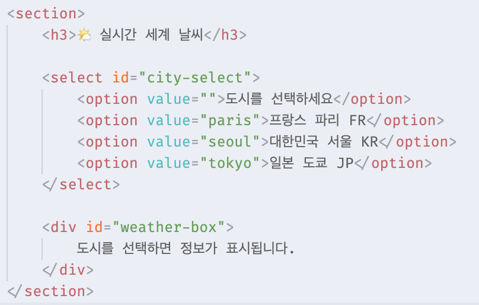
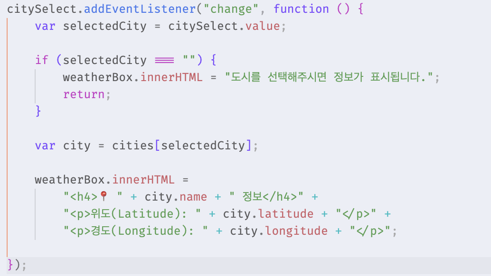

# [과제] 실시간 날씨 - DOM/이벤트

🗓️ 수행 날짜 : 2026-07-18    
👤 작성자 : 4기 광주 3반 정다운    
📚 수행 내용  
- 도시 별 좌표를 JavaScript Object로 만들고 그 내용을 보여준다.
  - index.html: 사이드바에 도시를 고를 수 있는 `<select>` 태그와 결과를 보여줄 `
`를 만드시오
  - weather.js: 사용자가 도시를 바꿀 때마다(change 이벤트), 선택된 도시의 이름과 위도/경도 좌표를 DOM 조작(innerHTML)을 통해 화면에 실시간으로 표시하시요. (아직 날씨는 안 나옵니다!)

## Doing

`/script/weather.js` 파일을 만들어 지역 별 위경도 좌표를 확인할 수 있는 코드를 작성했습니다.

- 도시들의 정보를 담은 객체인 cities를 만들고 HTML 요소를 가져와 사용자가 도시를 바꿀 때 마다 화면에 표시될 수 있도록 했습니다. 
- DOM 조작(innerHTML)을 이용해 weather-box 안 내용을 새 HTML로 바뀌도록 했습니다.

## 문제

- 그런데 처음에 제일 상단에 있는 '프랑스 파리 FR'를 선택하면 위도 경도 정보가 바로 안 뜨고, 다음에 있는 '대한민국 서울 KR'을 선택한 후 다시 '프랑스 파리 FR'을 선택해야만 파리의 정보가 뜨는 문제가 발생했습니다. 

## 해결
- 원인
  - `change` 이벤트가 값이 바뀔 떄만 실행되기 때문
  - 처음 화면이 열렸을 때 `<select>`의 기본 선택값은 이미 첫 번째 옵션인 '프랑스 파리 FR'
  - 따라서 사용자가 다시 첫 번째 옵션인 '프랑스 파리 FR'을 클릭한다면 값이 바뀐 게 아님 (paris -> paris)
  - 따라서 값의 변화가 없으므로 `change` 이벤트가 발생하지 않음 
- 해결
  - 초기 기본 선택값을 도시가 아닌 안내 문구로 선택되도록 함
     
  - 또한 안내 문구 선택시 value가 빈 값이므로 빈 값일 때를 처리해주는 JS 코드 추가 
    

## 결과

## 📝 자기 평가

이번 실습에서는 `select` 태그, `change` 이벤트, `innerHTML`을 사용해 사용자가 선택한 도시 정보를 화면에 표시하는 기능을 구현했습니다. 이전까지는 `alert()` 중심으로 JavaScript 결과를 확인했지만, 이번에는 DOM을 직접 조작해서 페이지 안의 내용이 바뀌도록 만들었다는 점에서 더 실제 웹 기능에 가까운 실습이었습니다.

구현 중 `selectedCity`와 `selectCity` 변수명을 다르게 작성해서 선택해도 정보가 표시되지 않는 문제가 있었습니다. 이 문제를 해결하면서 JavaScript에서는 변수 이름 오타가 바로 기능 오류로 이어진다는 점을 배웠습니다.

또한 첫 번째 옵션은 이미 기본 선택값이기 때문에 다시 클릭해도 `change` 이벤트가 발생하지 않는다는 점을 알게 되었습니다. `change`는 클릭이 아니라 값의 변경을 감지하는 이벤트라는 것을 이해했습니다.

이번 실습을 통해 객체에 도시 정보를 저장하고, 선택된 값으로 해당 객체 데이터를 꺼내 화면에 출력하는 흐름을 익힐 수 있었습니다.

그런데 다음 과제를 생각하면 함수로 구현할 걸 하는 아쉬움이 있습니다. 항상 함수 형태로 구현하려고 하는 습관을 길러야겠다는 생각을 했습니다. 