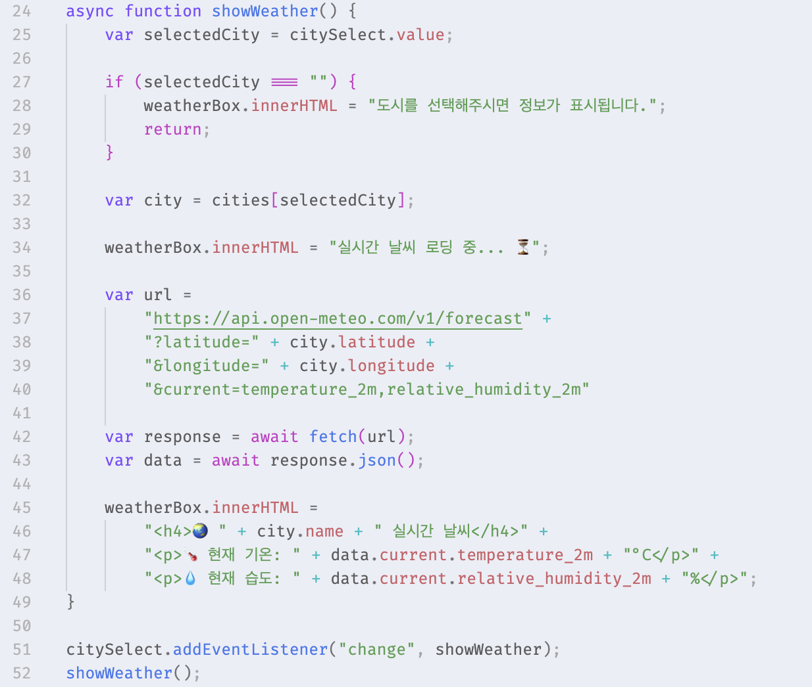

# [과제] 실시간 날씨 - 비동기 호출

🗓️ 수행 날짜 : 2026-07-18    
👤 작성자 : 4기 광주 3반 정다운    
📚 수행 내용  
- Open-Meteo 무료 API를 통해 날씨데이터를 비동기로 가져온다.
  - weather.js: 도시가 변경되었을 때, 단순 좌표 출력에 그치지 않고 `fetch()`와 `async/await` 문법을 사용해 Open-Meteo 서버에 날씨 데이터를 요청한다.
  - 데이터를 받아오는 동안 화면에 "로딩 중... ⏳" 메시지를 띄우고, 다운로드가 완료되면 진짜 실시간 온도와 습도를 화면에 그린다.

## Doing

`/script/weather.js` 파일에 Open-Meteo API를 호출하여 선택한 도시의 실시간 날씨를 가져오는 비동기 코드를 작성했습니다.

- 도시들의 이름, 위도, 경도 정보를 담은 `cities` 객체를 이용해 사용자가 선택한 도시의 좌표를 기준으로 날씨 데이터를 요청할 수 있도록 했습니다.
- `fetch()`와 `async/await`를 사용해 서버 응답을 기다린 뒤, 받아온 현재 기온과 습도 데이터를 화면에 표시했습니다.
- 데이터를 받아오는 동안 `weather-box`에 로딩 메시지를 먼저 보여주고, 응답이 완료되면 DOM 조작(`innerHTML`)으로 결과 내용을 바꾸도록 했습니다.

## 결과

## 📝 자기 평가

이번 과제에서는 이전 실습에서 도시의 위도와 경도를 화면에 출력하던 기능을 확장해, 실제 외부 API에서 날씨 데이터를 받아오는 흐름을 구현했습니다. `select` 태그와 `change` 이벤트로 사용자의 선택을 감지하고, 선택된 도시의 좌표를 이용해 Open-Meteo 서버에 요청을 보내는 방식이었습니다.

이번 구현을 통해 비동기 처리가 필요한 이유를 조금 더 구체적으로 이해할 수 있었습니다. API 요청은 즉시 결과가 돌아오는 일반 계산과 달리 응답을 기다리는 시간이 생길 수 있기 때문에, 데이터를 요청하기 전에 먼저 로딩 메시지를 보여주고 응답이 완료된 뒤 실제 결과로 바꿔주는 흐름이 중요하다는 것을 배웠습니다. `async/await`를 사용하면 비동기 작업을 순서대로 읽히는 코드처럼 작성할 수 있어 흐름을 이해하기 쉬웠습니다.

또한 API URL을 작성할 때는 주소, 쿼리 파라미터 이름, 좌표 값, 요청할 데이터 이름을 정확히 확인해야 한다는 점을 배웠습니다. 특히 습도 값을 요청하는 변수명에서 오타가 나서 API 응답이 기대한 형태와 달라지고, 화면에 값을 표시하는 부분도 정상적으로 동작하지 않음을 경험했습니다. 항상 JavaScript 변수명뿐 아니라 API에서 정해둔 파라미터 이름도 꼼꼼히 확인해야 한다는 것을 느꼈습니다.

비동기 구현 시에는 사용자가 기다리는 동안 현재 어떤 상태인지 알 수 있도록 로딩 메시지를 보여주는 것이 중요하다고 생각했습니다. 다음에는 네트워크 오류가 발생했을 때를 대비해 `try...catch`를 사용하고, 실패했을 때도 화면에 안내 메시지를 보여주는 방식으로 개선해보고 싶습니다.
