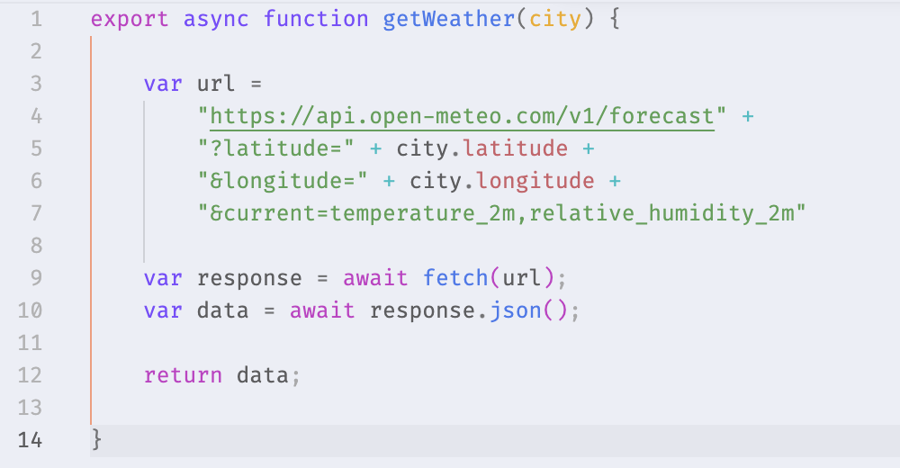
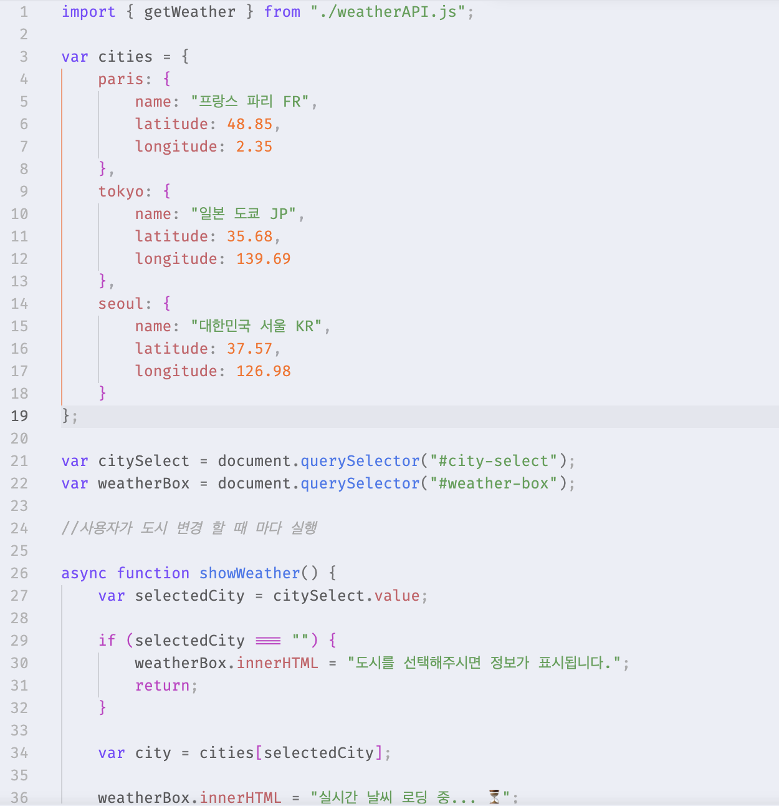
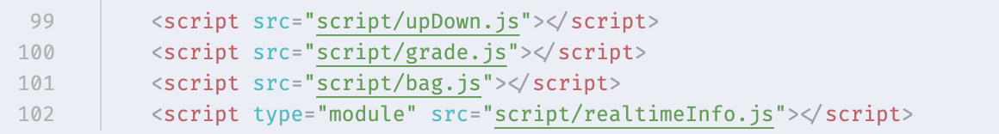

# [과제] 실시간 날씨 - 모듈분리

🗓️ 수행 날짜 : 2026-07-18    
👤 작성자 : 4기 광주 3반 정다운    
📚 수행 내용  
- weather.js를 데이터를 책임지는 weatherAPI.js와 화면을 책임지는 realtimeInfo.js로 분리한다.
  - index.html: ``
  - weatherAPI.js: export async function 분리
  - realtimeInfo.js: weatherAPI 로 부터 함수를 import 하여 처리

## Doing

기존 `/script/weather.js`에 함께 작성되어 있던 날씨 API 호출 코드와 화면 처리 코드를 역할별로 분리했습니다.

<!--  -->
- `/script/weatherAPI.js`에는 Open-Meteo API에 요청을 보내고 응답 데이터를 반환하는 `getWeather()` 함수를 작성했습니다.

- `/script/realtimeInfo.js`에는 도시 선택 이벤트 처리, 로딩 메시지 표시, 결과 화면 출력처럼 DOM을 다루는 코드를 작성했습니다.
- `weatherAPI.js`에서 `getWeather()` 함수를 `export`하고, `realtimeInfo.js`에서 해당 함수를 `import`하여 사용했습니다.

- `index.html`에서는 모듈 문법을 사용할 수 있도록 날씨 스크립트를 `type="module"` 방식으로 연결했습니다.

## 결과

## 📝 자기 평가

이번 과제에서는 기존 `weather.js`에 함께 작성되어 있던 API 호출 코드와 화면 처리 코드를 `weatherAPI.js`, `realtimeInfo.js`로 분리하면서 JavaScript 모듈의 기본 사용법을 연습했습니다. API 요청을 담당하는 함수는 `export`로 내보내고, 화면을 처리하는 파일에서는 `import`로 가져와 사용하는 구조를 이해할 수 있었습니다.

특히 `index.html`에서 모듈 문법을 사용하려면 script 태그에 `type="module"`을 반드시 작성해야 한다는 점을 배웠습니다. 일반 script 방식으로 연결하면 `import`와 `export` 문법을 사용할 수 없기 때문에, 모듈을 사용할 때는 HTML에서 연결 방식도 함께 바뀌어야 한다는 것을 알게 되었습니다.

처음에는 Live Server에서 실행했을 때 기능이 동작하지 않았는데, 확인해보니 `realtimeInfo.js`에서 `import { getWeather } from "./weatherAPI";`처럼 파일 확장자 `.js`가 빠져 있었습니다. 자동완성으로 작성하면서 확장자가 생략되었는데, 브라우저의 ES module import에서는 파일 경로를 정확히 작성해야 하므로 `./weatherAPI.js`처럼 확장자까지 포함해야 정상적으로 동작했습니다.

이번 실습을 통해 코드를 기능별로 분리하면 각 파일의 역할이 더 명확해지고 관리가 더 편해진다는 점을 느꼈습니다. 다음에는 파일명을 작성할 때 오타가 없는지, import 경로와 실제 파일명이 정확히 일치하는지 먼저 확인하는 습관을 들여야겠다고 생각했습니다.
