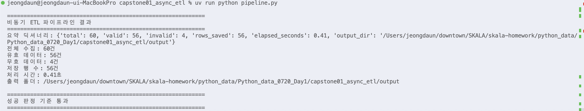
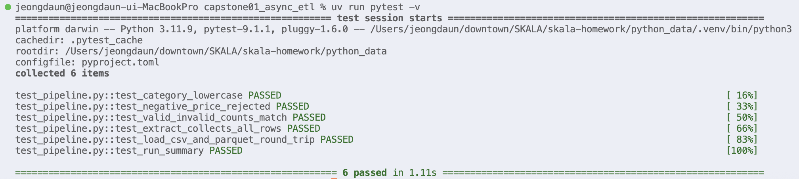
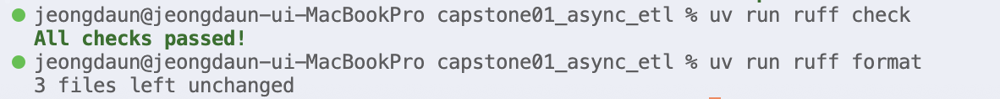

# Day1 종합실습 - 종합실습 01 비동기 ETL 파이프라인

수행 날짜: 2026-07-20  
작성자: 4기 광주 3반 정다운  
최종 제출 파일: `pipeline.py`  
모델 파일: `models.py`  
테스트 파일: `test_pipeline.py`

## 1. 실습 개요

앞선 실습 2의 Pydantic 검증과 실습 3의 asyncio 비동기 수집을 하나로 합쳐 ETL 파이프라인을 구성하는 종합실습입니다.

ETL은 Extract, Transform, Load의 약자로 데이터를 수집하고, 검증과 변환을 거친 뒤, 최종 저장소에 적재하는 흐름입니다.

이번 실습에서는 mock 상품 데이터를 비동기로 수집하고, Pydantic으로 유효/무효 데이터를 분리한 뒤, 유효 데이터만 CSV와 Parquet 파일로 저장했습니다.

## 2. 폴더 구조

```text
capstone01_async_etl/
├── models.py
├── pipeline.py
├── test_pipeline.py
├── readme.md
└── output/
    ├── products.csv
    ├── products.parquet
    └── invalid_records.json
```

| 파일 | 역할 |
| --- | --- |
| `models.py` | Pydantic `Product` 모델 정의 |
| `pipeline.py` | Extract, Transform, Load, `run()` 조율 |
| `test_pipeline.py` | pytest 테스트 6개 작성 |
| `output/products.csv` | 유효 데이터 CSV 저장 결과 |
| `output/products.parquet` | 유효 데이터 Parquet 저장 결과 |
| `output/invalid_records.json` | 무효 데이터 오류 리포트 |

## 3. 수행 내용

1. `models.py`에 `Product` Pydantic 모델 작성
2. `category` 값은 `field_validator`로 공백 제거 후 소문자화
3. `price`는 `Field(gt=0)`로 0 초과만 허용
4. `extract()`에서 60건의 mock 데이터를 비동기로 수집
5. `Semaphore`로 동시 요청 수 10개 제한
6. 일시 실패 데이터는 지수 백오프로 재시도
7. `transform()`에서 유효/무효 데이터 분리
8. `load()`에서 유효 데이터를 DataFrame으로 변환 후 CSV와 Parquet 저장
9. `run()`에서 E, T, L 단계를 순서대로 조율
10. pytest 테스트 6개로 단계별 동작 검증

## 4. 핵심 구현

### Extract

실습 3의 비동기 수집 구조를 재사용했습니다.

`asyncio.gather()`로 여러 작업을 동시에 실행하고, `asyncio.Semaphore`로 동시에 처리되는 요청 수를 제한했습니다.

```python
async def extract(ids: list[int], max_concurrent: int = MAX_CONCURRENT) -> list[RawProduct]:
    sem = asyncio.Semaphore(max_concurrent)
    tasks = [fetch_with_retry(item_id, sem) for item_id in ids]
    results = await asyncio.gather(*tasks, return_exceptions=True)

    return [result for result in results if not isinstance(result, BaseException)]
```

`TRANSIENT_FAILURES = {7, 19, 41}`은 첫 번째 시도에서만 실패하도록 만든 mock 데이터입니다.

재시도 후 성공하도록 구성해 비동기 수집과 retry 흐름을 확인했습니다.

### Transform

실습 2의 Pydantic 검증 구조를 재사용했습니다.

`Product.model_validate(row)`로 각 row를 검증하고, 성공하면 `valid`, 실패하면 `invalid`에 분리했습니다.

```python
def transform(raw: list[RawProduct]) -> tuple[list[Product], list[InvalidRecord]]:
    valid = []
    invalid = []

    for row in raw:
        try:
            valid.append(Product.model_validate(row))
        except ValidationError as error:
            invalid.append({"data": row, "errors": serialize_errors(error)})

    return valid, invalid
```

`INVALID_PRICE_IDS = {6, 18, 33, 47}`은 음수 가격을 만들기 위한 mock 오염 데이터입니다.

전체 60건 중 56건은 유효 데이터, 4건은 무효 데이터로 분리됩니다.

### Load

유효 데이터는 `model_dump()`로 dict로 변환한 뒤 DataFrame으로 만들었습니다.

이후 CSV와 Parquet 파일을 모두 저장했습니다.

```python
records = [product.model_dump() for product in valid]
df = pd.DataFrame(records, columns=["id", "name", "category", "price"])

df.to_csv(output_path / "products.csv", index=False)
df.to_parquet(output_path / "products.parquet", index=False)
```

Parquet 저장과 라운드트립 테스트를 위해 `pyarrow`를 추가했습니다.

### Orchestrate

`run()`은 직접 계산하지 않고 E, T, L 단계를 순서대로 호출하는 조율 역할만 하도록 구성했습니다.

```python
async def run(ids: list[int], output_dir: str | Path = OUTPUT_DIR) -> Summary:
    raw = await extract(ids)
    valid, invalid = transform(raw)
    df = load(valid, output_dir=output_dir)
    save_invalid(invalid, output_dir=output_dir)
```

이 구조 덕분에 `extract`, `transform`, `load`, `run`을 각각 따로 테스트할 수 있습니다.

## 5. 테스트 항목

| 테스트 | 검증 내용 |
| --- | --- |
| `test_category_lowercase` | 카테고리 공백 제거 및 소문자화 |
| `test_negative_price_rejected` | 음수 가격 거부 |
| `test_valid_invalid_counts_match` | 유효/무효 분리 건수 일치 |
| `test_extract_collects_all_rows` | 비동기 수집 결과 건수 확인 |
| `test_load_csv_and_parquet_round_trip` | CSV/Parquet 저장 및 Parquet 재로딩 |
| `test_run_summary` | 전체 파이프라인 요약 값 확인 |

## 6. 실행 결과

파이프라인 실행

```bash
uv run python Python_data_0720_Day1/capstone01_async_etl/pipeline.py
```

```text
요약 딕셔너리: {'total': 60, 'valid': 56, 'invalid': 4, 'rows_saved': 56, ...}
전체 수집: 60건
유효 데이터: 56건
무효 데이터: 4건
저장 행 수: 56건
처리 시간: 0.37초
성공 판정 기준 통과
```



pytest 실행

```bash
uv run pytest -v Python_data_0720_Day1/capstone01_async_etl
```

```text
6 passed
```



Ruff 실행

```bash
uv run ruff check Python_data_0720_Day1/capstone01_async_etl
uv run ruff format Python_data_0720_Day1/capstone01_async_etl
```

```text
All checks passed!
```



## 7. 성공 판정 기준 확인

| 기준 | 결과 |
| --- | --- |
| `pipeline.py` 실행 시 오류 없음 | 통과 |
| 요약 딕셔너리 출력 | 통과 |
| 전체 60건 수집 | 통과 |
| 유효 56건 / 무효 4건 분리 | 통과 |
| 카테고리 소문자화 | 통과 |
| 음수 가격 거부 | 통과 |
| CSV 저장 | 통과 |
| Parquet 저장 | 통과 |
| Parquet 라운드트립 테스트 | 통과 |
| pytest 6개 테스트 | 통과 |
| Ruff 검사 | 통과 |

## 8. 정리

이번 종합실습에서는 실습 3에서 구현한 비동기 수집 기능과 실습 2의 Pydantic 검증 기능을 결합해, 하나의 ETL 파이프라인으로 구성해보았습니다.

데이터를 수집하는 `extract`, 검증하고 가공하는 `transform`, 결과를 저장하는 `load`, 전체 과정을 실행하는 `run`으로 단계를 나누면서 각 기능의 역할을 명확하게 구분할 수 있었습니다. 또한 각 단계를 독립적으로 테스트할 수 있어, 문제가 발생했을 때 원인을 더 쉽게 찾을 수 있다는 점도 배울 수 있었습니다.

검증을 통과한 데이터는 CSV와 Parquet 형식으로 저장하고, 검증에 실패한 데이터는 `invalid_records.json` 파일에 별도로 남겨 어떤 데이터가 어떤 이유로 실패했는지 확인할 수 있도록 했습니다. 이전 실습에서 각각 구현했던 기능들이 하나의 흐름으로 연결되는 과정을 확인할 수 있어 의미 있었습니다.

다만 이번 실습은 실제 HTTP API가 아닌 mock 데이터를 기반으로 진행했기 때문에, 실제 환경에서 발생할 수 있는 네트워크 오류나 응답 지연, API 스키마 변경과 같은 상황까지 확인하지 못한 점은 아쉬웠습니다.

추가로 실제 HTTP 요청을 사용하는 수집 모드를 구현해보고 싶고, 실패한 데이터를 dead-letter로 관리한 뒤 다시 처리하는 기능도 만들어보고 싶습니다. 또한 CLI 옵션을 통해 실행 방식을 설정하는 기능과 로그를 파일로 저장하는 기능을 추가해보고 싶으며, GitHub Actions에서 pytest와 ruff가 자동으로 실행되도록 구성하는 것도 도전해보고 싶습니다.
