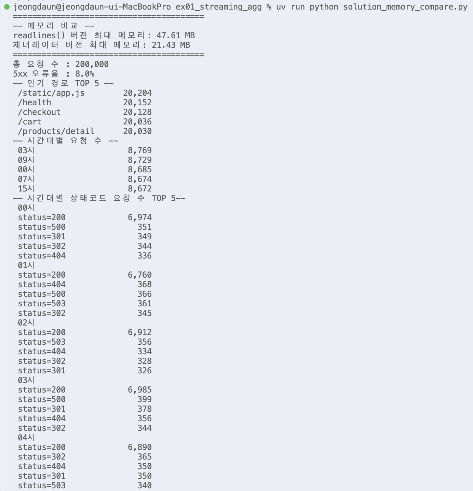
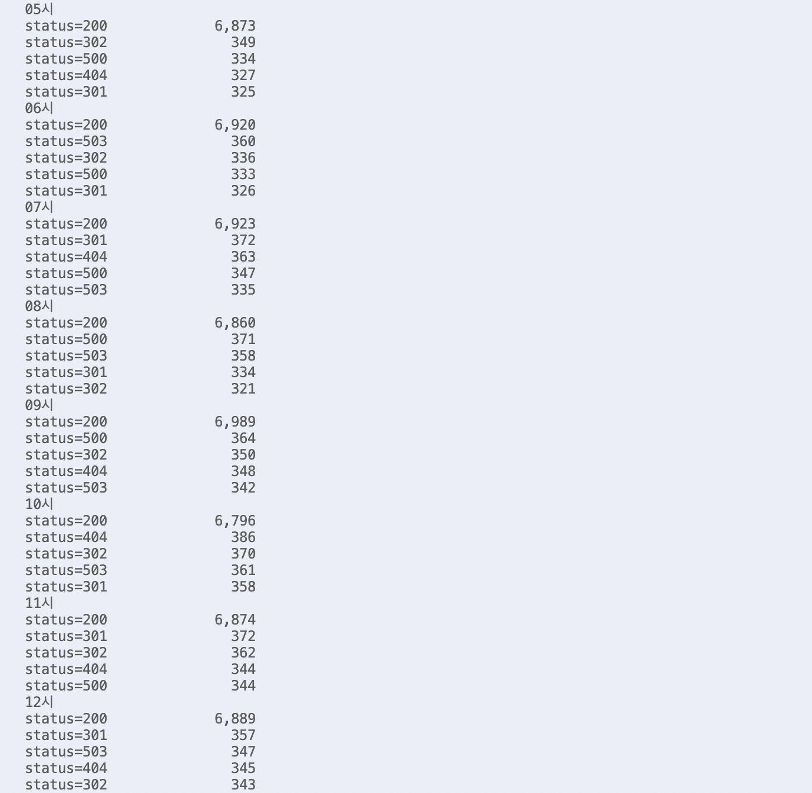
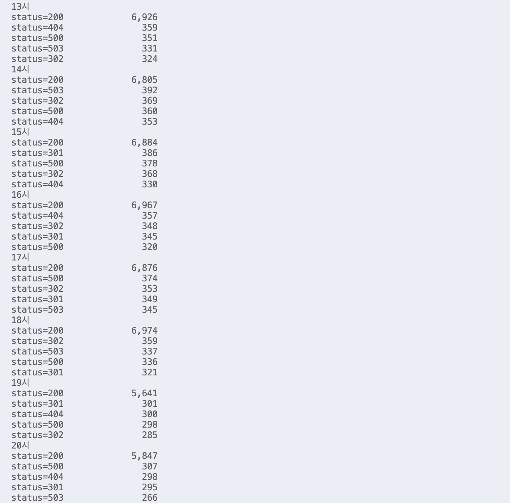
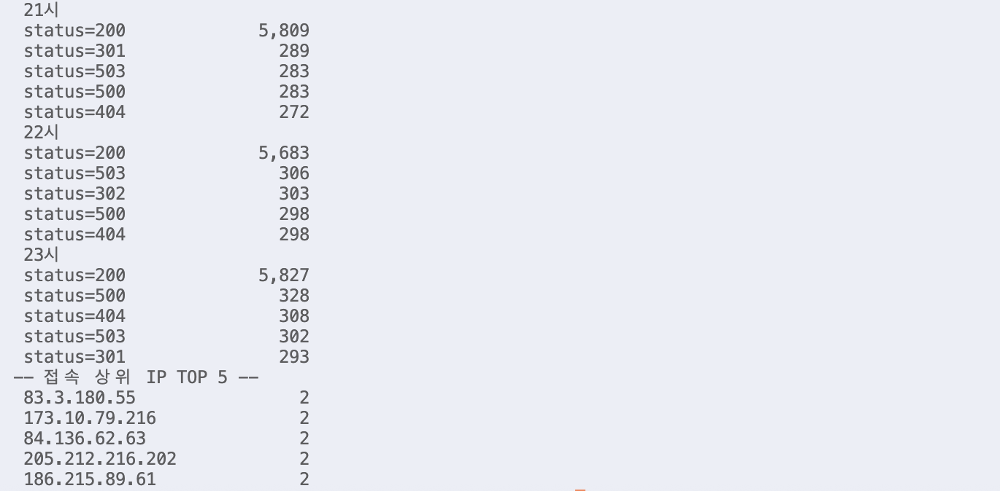
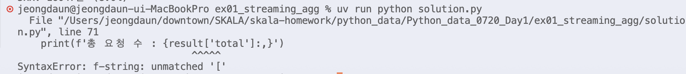

# Day1 종합실습 - 실습 01 대용량 로그 스트리밍 집계

수행 날짜: 2026-07-20  
작성자: 4기 광주 3반 정다운  
최종 제출 파일: `solution.py`  
자율 학습 파일: `study_guide.py`

## 1. 실습 개요

`web_logs.csv` 파일의 20만 건 웹 접속 로그를 한 번에 메모리에 올리지 않고, 제너레이터로 한 줄씩 읽어 필요한 지표를 누적하는 실습

대용량 파일을 스트리밍 방식으로 처리하면서 `Counter`, `defaultdict`, `functools.reduce`, `tracemalloc`을 활용해 로그 요약 리포트 생성

## 2. 사용 데이터

| 항목 | 내용 |
| --- | --- |
| 입력 파일 | `web_logs.csv` |
| 데이터 규모 | 200,000행 |
| 데이터 내용 | 웹 접속 로그 |
| 실행 파일 | `solution.py` |

## 3. 수행 내용

1. `csv.DictReader`를 사용해 로그 파일을 dict 형태로 읽기
2. `yield`를 사용한 `read_logs()` 제너레이터로 파일을 한 줄씩 처리
3. `Counter`를 사용해 상태코드, 경로, IP, 시간대별 요청 수 누적 방식 학습
4. `defaultdict(Counter)` 사용 연습을 위해 시간대별 상태코드 요청 수 리포트 추가
5. `functools.reduce()`와 `fold()` 함수로 누적 집계 로직 정리
6. `tracemalloc`으로 `readlines()` 방식과 제너레이터 방식의 최대 메모리 사용량 비교
7. 총 요청 수, 5xx 오류율, 인기 경로, 시간대별 요약, 접속 상위 IP 출력

## 4. 핵심 구현

### 제너레이터 기반 파일 읽기

`read_logs()` 함수는 `yield`를 사용해 로그를 한 줄씩 반환. 전체 파일을 리스트로 만들지 않기 때문에 대용량 파일 처리에 적합

### 누적 집계

`fold()` 함수는 로그 한 행을 받아 누적기 `acc`에 다음 값을 갱신

- 전체 요청 수
- 상태코드별 요청 수
- 경로별 요청 수
- IP별 요청 수
- 시간대별 요청 수
- 시간대별 상태코드 요청 수

`Counter`로 항목별 개수 누적 방식 이해. `defaultdict`를 실제 코드에 적용하기 위해 시간대별로 `Counter`를 자동 생성하는 `defaultdict(Counter)` 구조 사용

### 메모리 비교

확장 과제로 `readlines()` 버전과 제너레이터 버전을 각각 실행해 최대 메모리 비교

실행 결과 예시:

```text
readlines() 버전 최대 메모리: 51.62 MB
제너레이터 버전 최대 메모리: 25.43 MB
```

## 5. 실행 결과

`solution.py` 실행 결과, 성공 판정 기준 만족

```text
총 요청 수 : 200,000
5xx 오류율 : 8.0%
```

콘솔 출력 리포트

- 인기 경로 TOP 5
- 시간대별 요청 수
- 시간대별 상태코드 요청 수 TOP 5
- 접속 상위 IP TOP 5

시간대별 상태코드 요청 수 TOP 5는 `defaultdict(Counter)` 활용을 위해 추가한 리포트 항목







## 6. 오류 발생 및 수정

`solution.py` 실행 중 f-string 따옴표 사용 오류로 `SyntaxError` 발생


오류 원인


바깥 f-string에도 작은따옴표 사용, 딕셔너리 key 접근에도 작은따옴표 사용  
`result['total']` 부분에서 문자열이 중간에 끊긴 것으로 해석되어 `unmatched '['` 오류 발생

수정 내용


바깥 f-string은 큰따옴표, 내부 key 접근은 작은따옴표로 구분  
따옴표 충돌 제거 후 정상 실행 확인


## 7. 성공 판정 기준 확인

| 기준 | 결과 |
| --- | --- |
| Traceback 없이 종료 | 통과 |
| 총 건수 200,000 출력 | 통과 |
| 5xx 비율 약 8% 출력 | 통과 |
| 경로별 요약 출력 | 통과 |
| 시간대별 요약 출력 | 통과 |
| 시간대별 상태코드 요청 수 출력 | 통과 |
| 상위 IP 표 출력 | 통과 |
| `tracemalloc` 메모리 비교 | 수행 |

## 8. 정리

이번 실습에서는 대용량 로그 파일을 전체 메모리에 올리지 않고, 제너레이터로 한 줄씩 읽어 집계하는 것을 했습니다.

`Counter`와 `defaultdict`를 함께 사용해 상태코드, 경로, 시간대, IP, 시간대별 상태코드 요청 수를 누적하는 것을 했습니다.

아쉬운 점은 입력 파일 경로와 출력 항목이 코드 안에 고정되어 있어 다른 로그 파일을 분석하려면 코드를 직접 수정해야 한다는 점입니다.

