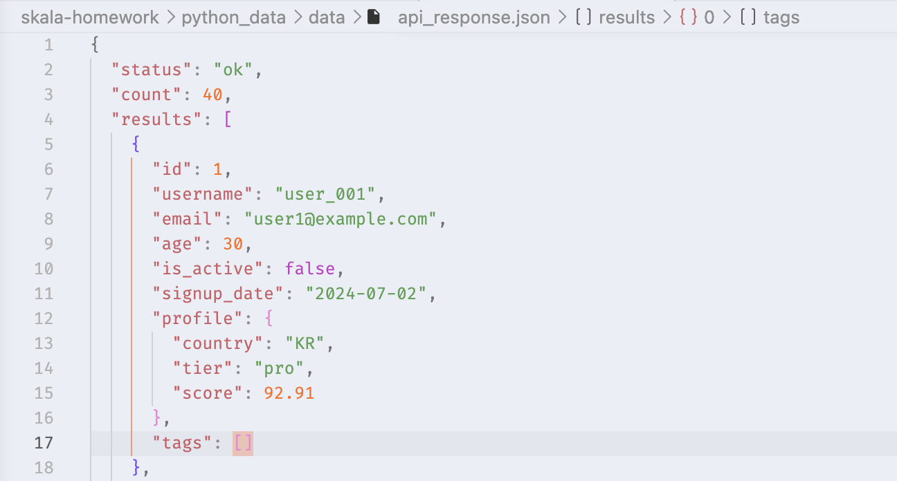
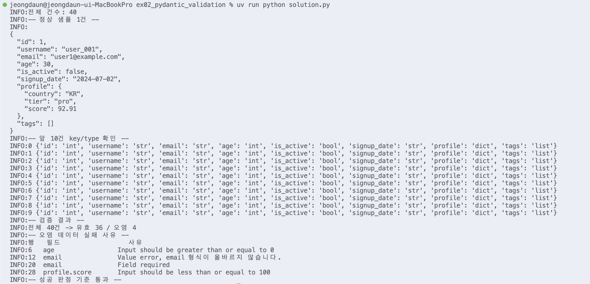

# Day1 종합실습 - 실습 02 Pydantic v2 중첩 스키마 검증

수행 날짜: 2026-07-20  
작성자: 4기 광주 3반 정다운  
최종 제출 파일: `solution.py`  
자율 학습 파일: `study_guide.py`

## 1. 실습 개요

외부 API 응답 데이터 `api_response.json` 40건을 Pydantic v2 모델로 검증하는 실습

데이터의 타입, 범위, 필수 필드, 중첩 구조를 선언적으로 검증하고, 규칙에 맞는 데이터와 오염 데이터를 분리

유효/무효 레코드 건수와 실패 사유를 표 형태로 출력

## 2. 사용 데이터

| 항목 | 내용 |
| --- | --- |
| 입력 파일 | `api_response.json` |
| 데이터 규모 | 40건 |
| 데이터 내용 | 사용자 API 응답 데이터 |
| 실행 파일 | `solution.py` |

## 3. 수행 내용

1. `api_response.json` 로딩 후 최상위 구조 확인
2. `data["results"]` 기준으로 실제 사용자 40건 추출
3. 앞 10건의 key와 value 타입 확인
4. `Annotated`와 `Field()`로 타입/범위/정규식 조건 선언
5. `field_validator`로 이메일, 국가, 등급, 태그 값 정리 및 검증
6. `Profile` 모델을 `User` 모델 안에 포함해 중첩 구조 검증
7. `ValidationError`만 잡아 유효/오염 데이터 분리
8. 오염 데이터의 필드명과 실패 사유를 표로 출력
9. `main()`과 `if __name__ == "__main__"` 구조로 재사용 가능하게 구성

## 4. 핵심 구현

### 데이터 구조 확인

`api_response.json`의 최상위 구조는 리스트가 아니라 dict 구조

```text
status
count
results
```


실제 검증 대상은 `data["results"]` 안의 사용자 데이터 40건

### Pydantic 모델 정의

`Profile` 모델과 `User` 모델을 분리해 중첩 구조 검증

- `Profile.country`
- `Profile.tier`
- `Profile.score`
- `User.email`
- `User.age`
- `User.profile`

`profile.score`처럼 안쪽 객체의 필드까지 Pydantic이 자동으로 검증

### Field 조건

`Annotated`와 `Field()`를 사용해 값의 범위와 형식 선언

- `id`: 0 초과
- `age`: 0 이상 120 이하
- `signup_date`: `YYYY-MM-DD` 형식
- `profile.score`: 0 이상 100 이하

### field_validator

`Field()`만으로 표현하기 어려운 규칙은 `field_validator`로 처리

- `email`: `@`와 도메인 점 포함 여부 확인
- `country`: 앞뒤 공백 제거 후 대문자 변환
- `tier`: 앞뒤 공백 제거 후 소문자 변환, 허용 등급 확인
- `tags`: 각 태그 앞뒤 공백 제거 후 소문자 변환

### 실패 사유 표 출력

오염 데이터는 `ValidationError`를 통해 실패 사유를 수집

중첩 필드는 다음 코드로 경로 표시

```python
field = ".".join(str(value) for value in error["loc"])
```

예시

```text
profile.score
```

`profile` 안쪽의 `score` 필드 오류라는 의미

## 5. 실행 결과

`solution.py` 실행 결과, 성공 판정 기준 만족

```text
전체 40건 -> 유효 36 / 오염 4
```

오염 데이터 실패 사유 표 출력

```text
행   필드                  사유
6   age                 Input should be greater than or equal to 0
12  email               Value error, email 형식 오류
20  email               Field required
28  profile.score       Input should be less than or equal to 100
```



## 6. 오염 데이터 분석

| 행 | 필드 | 원인 |
| --- | --- | --- |
| 6 | `age` | 음수 값 |
| 12 | `email` | 이메일 형식 오류 |
| 20 | `email` | 필수 필드 누락 |
| 28 | `profile.score` | 허용 범위 초과 |


## 7. 성공 판정 기준 확인

| 기준 | 결과 |
| --- | --- |
| 오류 없이 종료 | 통과 |
| 전체 40건 출력 | 통과 |
| 유효 36건 / 오염 4건 분리 | 통과 |
| 각 오염 건의 실패 사유 표 출력 | 통과 |
| 중첩 경로 `profile.score` 표시 | 통과 |
| `ValidationError` 기반 분리 | 통과 |
| `main()` 구조 적용 | 적용 |

## 8. 정리

이번 실습에서는 외부 API 응답 데이터를 그대로 사용하지 않고, Pydantic 모델을 활용해 데이터가 들어오는 단계에서부터 검증하는 방법을 익혔습니다.

타입 힌트와 `Field()`, `field_validator`, 중첩 모델을 사용해 정상 데이터와 오류가 포함된 데이터를 구분했습니다. 또한 검증에 실패한 데이터도 바로 버리지 않고, 문제가 발생한 필드명과 원인을 함께 기록해 이후에 오류를 추적할 수 있도록 했습니다.

아쉬웠던 점은 날짜 값을 실제 `date` 타입으로 변환해 검증하지 않고, 문자열 패턴만 확인했다는 점입니다.

추가로 개선해볼 수 있는 부분으로는 `EmailStr`을 활용한 이메일 검증을 적용해보는 것을 한 번 시도해보고 싶고, `signup_date`를 실제 날짜 타입으로 변환해 검증하는 것도 해보고 싶습니다. 
