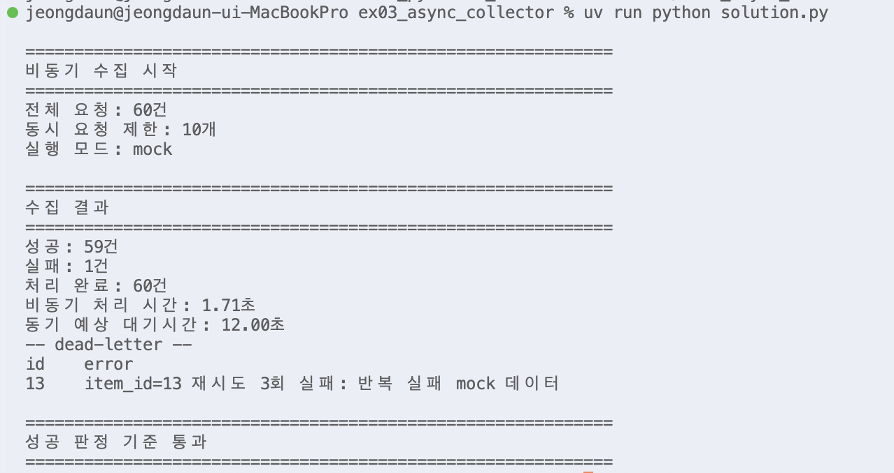

# Day1 종합실습 - 실습 03 asyncio 기반 비동기 수집기

수행 날짜: 2026-07-20  
작성자: 4기 광주 3반 정다운  
최종 제출 파일: `solution.py`

## 1. 실습 개요

여러 곳에서 데이터를 가져오는 상황을 가정하고, `asyncio` 기반 비동기 수집기로 60건의 요청을 동시에 처리하는 실습

기본 실행값은 `USE_REAL_HTTP=False`로 설정해 인터넷 없이 mock 요청으로 동작

동시에 너무 많은 요청이 나가지 않도록 `Semaphore`로 최대 동시 요청 수 제한

실패한 요청은 지수 백오프로 재시도하고, 끝까지 실패한 요청은 `dead_letter.json`으로 격리

## 2. 수행 조건

| 항목 | 내용 |
| --- | --- |
| 폴더 | `ex03_async_collector` |
| 문제 | 여러 곳의 데이터를 동시에 모아 오기 |
| 기본값 | `USE_REAL_HTTP=False` |
| 전체 요청 | 60건 |
| 동시 요청 제한 | 10개 |
| 실행 파일 | `solution.py` |

## 3. 수행 내용

1. mock 요청 함수 작성
2. `async def`와 `await`를 사용해 비동기 작업 구성
3. `asyncio.gather()`로 60건의 작업을 동시에 예약
4. `asyncio.Semaphore`로 동시에 실행되는 요청 수 10개 제한
5. `asyncio.wait_for()`로 요청별 타임아웃 적용
6. 실패 시 지수 백오프 방식으로 재시도
7. `return_exceptions=True`로 일부 실패가 전체 실패로 번지지 않도록 격리
8. 최종 실패 건은 `dead_letter.json`으로 별도 저장
9. `main()`과 `if __name__ == "__main__"` 구조 적용

## 4. 핵심 구현

### async / await

`request_mock()`은 `async def`로 정의한 코루틴 함수

요청 대기 시간은 `time.sleep()`이 아니라 `await asyncio.sleep()` 사용

```python
async def request_mock(item_id: int, attempt: int) -> FetchResult:
    await asyncio.sleep(MOCK_DELAY)
```

`time.sleep()`은 프로그램 전체를 멈추는 동기 대기

`asyncio.sleep()`은 현재 작업만 잠시 쉬고, 그동안 다른 코루틴 실행 가능

### gather

60건의 요청을 리스트로 만든 뒤 `asyncio.gather()`에 전달

순서대로 하나씩 기다리는 방식이 아니라, 여러 작업을 한꺼번에 예약하고 결과를 모으는 구조

```python
tasks = [fetch_with_retry(item_id, sem) for item_id in item_ids]
results = await asyncio.gather(*tasks, return_exceptions=True)
```

`return_exceptions=True` 덕분에 한 건이 실패해도 전체 수집은 계속 진행

### Semaphore

`MAX_CONCURRENT = 10`으로 설정

60건을 한 번에 전부 실행하지 않고, 동시에 10개까지만 요청 통과

```python
sem = asyncio.Semaphore(MAX_CONCURRENT)

async with sem:
    return await asyncio.wait_for(
        request_item(item_id, attempt, client),
        timeout=REQUEST_TIMEOUT,
    )
```

이 구조가 백프레셔 역할

서버나 네트워크에 과도한 요청이 한꺼번에 몰리지 않도록 조절

### timeout

요청별 제한 시간은 `REQUEST_TIMEOUT = 3.0`

현재 실행 환경의 파이썬 버전 호환을 위해 `asyncio.wait_for()` 사용

응답이 제한 시간을 넘기면 `asyncio.TimeoutError` 발생

### retry + exponential backoff

요청 실패 시 바로 반복하지 않고 잠시 기다린 뒤 재시도

대기 시간은 실패할수록 증가

```python
wait = BACKOFF_BASE * (2 ** attempt)
await asyncio.sleep(wait)
```

실패 직후 바로 재요청하면 서버에 부담 가능

지수 백오프는 잠깐 물러났다가 다시 시도하는 방식

### dead-letter

재시도까지 모두 실패한 요청은 버리지 않고 `dead_letter.json`에 저장

```json
[
  {
    "id": 13,
    "error": "item_id=13 재시도 3회 실패: 반복 실패 mock 데이터"
  }
]
```

실패 데이터를 따로 남겨 나중에 재처리하거나 원인 확인 가능

## 5. 실행 결과

`solution.py` 실행 결과

```text
전체 요청: 60건
동시 요청 제한: 10개
실행 모드: mock
성공: 59건
실패: 1건
처리 완료: 60건
비동기 처리 시간: 1.72초
동기 예상 대기시간: 12.00초
```



## 6. 실패 데이터 분석

| id | 원인 | 처리 |
| --- | --- | --- |
| 13 | 반복 실패 mock 데이터 | `dead_letter.json` 저장 |

`TRANSIENT_FAILURES = {7, 19, 41}`은 첫 번째 시도에서만 실패하도록 둔 임시 실패 데이터

재시도 후 정상 성공

`PERMANENT_FAILURES = {13}`은 모든 재시도에서 실패하도록 둔 최종 실패 데이터

dead-letter 격리 대상

## 7. 성공 판정 기준 확인

| 기준 | 결과 |
| --- | --- |
| 오류 없이 종료 | 통과 |
| 전체 60건 처리 | 통과 |
| 약 1.7초 내외 처리 | 통과 |
| 동기 방식 대비 대기시간 감소 | 통과 |
| 동시 요청 수 제한 | 적용 |
| 재시도와 지수 백오프 | 적용 |
| 최종 실패 dead-letter 격리 | 적용 |
| `main()` 구조 | 적용 |

## 8. 정리

이번 실습에서는 `asyncio`를 활용해 60건의 요청을 비동기로 처리하는 수집기를 만들어보았습니다.

`gather`로 여러 작업을 한 번에 실행하고, `Semaphore`를 사용해 동시에 처리되는 요청 수를 제한했습니다. 여기에 타임아웃과 재시도 기능도 적용하면서, 비동기 요청을 안정적으로 관리하는 방법을 익힐 수 있었습니다.

재시도 후에도 실패한 요청은 `dead_letter.json` 파일에 따로 저장해, 일부 요청에 문제가 생기더라도 전체 작업이 중단되지 않도록 처리했습니다.

다만 이번 실습에서는 실제 HTTP 요청이 아닌 mock 요청을 기본으로 사용했기 때문에, 실제 네트워크 환경에서 발생할 수 있는 지연이나 서버 오류, 응답 데이터 형식 문제까지 확인하지 못한 점은 아쉬웠습니다.

추가로 `USE_REAL_HTTP=True`로 실제 요청을 실행해보고 싶고, 재시도 대기 시간에 jitter를 적용해 요청이 한꺼번에 몰리는 상황도 줄여보고 싶습니다. 