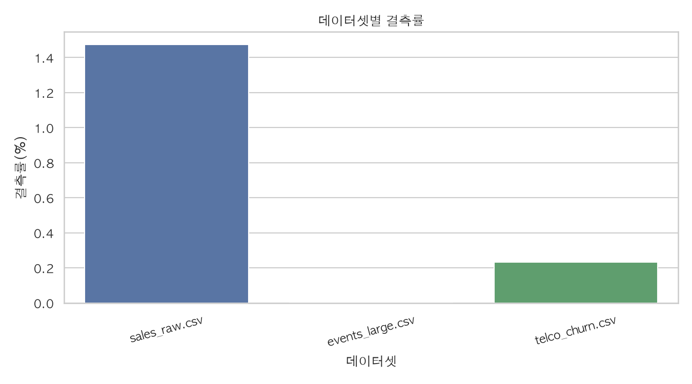

# Advanced - 데이터 품질 감사 리포트

## 수행 목적

Day2 실습에서 다룬 정제, EDA, 시각화, 자동화 흐름을 확장해 공통 데이터 품질 감사 도구를 작성했습니다.

데이터셋별 결측률, 중복 행, 수치형 IQR 이상치 후보, 품질 점수를 자동 산출했습니다.

## 데이터셋 요약

| dataset | rows | columns | missing_cells | missing_rate | duplicate_rows | duplicate_rate | numeric_columns | iqr_outlier_candidates | iqr_outlier_rate | quality_score |
| --- | --- | --- | --- | --- | --- | --- | --- | --- | --- | --- |
| sales_raw.csv | 5000 | 7 | 516 | 1.474 | 0 | 0.0 | 3 | 67 | 0.447 | 95.13 |
| events_large.csv | 1000000 | 5 | 0 | 0.0 | 0 | 0.0 | 3 | 79906 | 2.664 | 97.34 |
| telco_churn.csv | 7000 | 10 | 162 | 0.231 | 0 | 0.0 | 6 | 3477 | 8.279 | 91.03 |

## 결측률 상위 컬럼

| dataset | column | dtype | missing_count | missing_rate | unique_count | iqr_outlier_candidates |
| --- | --- | --- | --- | --- | --- | --- |
| sales_raw.csv | region | str | 306 | 6.12 | 5 | 0 |
| sales_raw.csv | unit_price | float64 | 210 | 4.2 | 4756 | 14 |
| telco_churn.csv | total_charges | float64 | 162 | 2.314 | 6702 | 51 |
| sales_raw.csv | order_id | str | 0 | 0.0 | 5000 | 0 |
| telco_churn.csv | customer_id | str | 0 | 0.0 | 7000 | 0 |
| telco_churn.csv | num_services | int64 | 0 | 0.0 | 8 | 0 |
| telco_churn.csv | payment_method | str | 0 | 0.0 | 4 | 0 |
| telco_churn.csv | contract | str | 0 | 0.0 | 3 | 0 |
| telco_churn.csv | monthly_charges | float64 | 0 | 0.0 | 5061 | 0 |
| telco_churn.csv | tenure_months | int64 | 0 | 0.0 | 73 | 0 |

## IQR 이상치 후보 상위 컬럼

| dataset | column | dtype | missing_count | missing_rate | unique_count | iqr_outlier_candidates |
| --- | --- | --- | --- | --- | --- | --- |
| events_large.csv | amount | float64 | 0 | 0.0 | 73771 | 79906 |
| telco_churn.csv | senior | int64 | 0 | 0.0 | 2 | 1741 |
| telco_churn.csv | churn | int64 | 0 | 0.0 | 2 | 1685 |
| sales_raw.csv | quantity | int64 | 0 | 0.0 | 62 | 53 |
| telco_churn.csv | total_charges | float64 | 162 | 2.314 | 6702 | 51 |
| sales_raw.csv | unit_price | float64 | 210 | 4.2 | 4756 | 14 |
| sales_raw.csv | category | str | 0 | 0.0 | 5 | 0 |
| sales_raw.csv | region | str | 306 | 6.12 | 5 | 0 |
| telco_churn.csv | num_services | int64 | 0 | 0.0 | 8 | 0 |
| telco_churn.csv | payment_method | str | 0 | 0.0 | 4 | 0 |

## 시각화

정적 결측률 차트:

인터랙티브 품질 점수 차트:

[quality score](../assets/quality_score.html)

## 해석

결측률이 높은 컬럼은 정제 우선순위가 높고, IQR 이상치 후보가 많은 컬럼은 삭제보다 도메인 의미 확인이 먼저 필요합니다.

이번 Advanced 실습은 분석 시작 전 데이터 품질을 빠르게 점검하는 사전 QA 단계로 활용할 수 있습니다.
