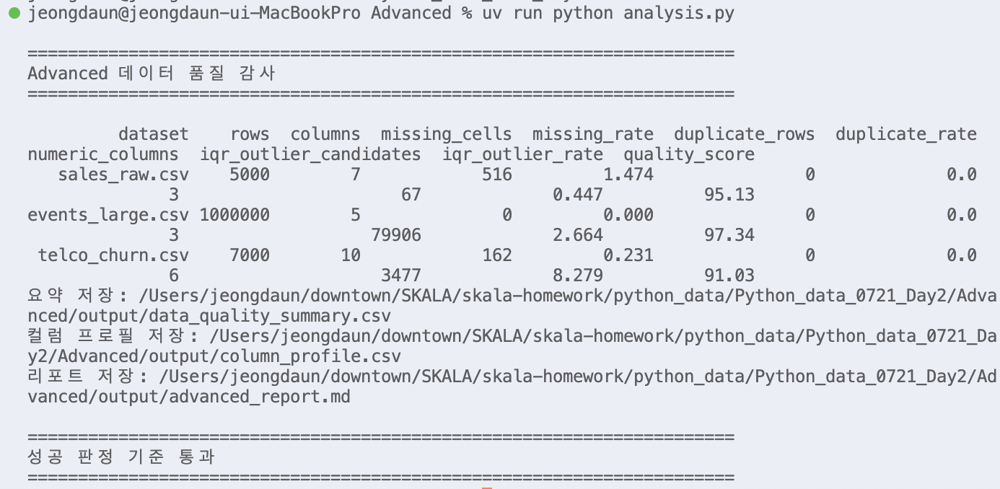

# Day2 Advanced - 데이터 품질 감사 리포트

수행 날짜: 2026-07-22  
작성자: 4기 광주 3반 정다운  
최종 제출 파일: `analysis.py`  
사용 데이터 폴더: `../data`

## 1. 실습 개요

Day2 실습에서 배운 데이터 정제, EDA, 시각화, 자동화 흐름을 확장해 데이터 품질 감사 도구를 작성했습니다.

하나의 데이터셋만 보는 것이 아니라 `data` 폴더 안의 CSV 파일들을 공통 기준으로 점검하고, 데이터셋별 결측률, 중복률, IQR 이상치 후보율, 품질 점수를 자동 산출했습니다.

## 2. 사용 데이터

| 데이터셋 | 행 수 | 주요 목적 |
| --- | ---: | --- |
| `sales_raw.csv` | 5,000 | 주문 데이터 정제 실습 |
| `events_large.csv` | 1,000,000 | 대용량 이벤트 성능 비교 |
| `telco_churn.csv` | 7,000 | 이탈 예측 분석 |

## 3. 수행 내용

1. `data` 폴더의 CSV 파일을 순회하며 자동 로딩
2. 데이터셋별 행 수, 컬럼 수, 결측 셀 수, 중복 행 수 계산
3. 수치형 컬럼에 대해 IQR 이상치 후보 수 계산
4. 결측률, 중복률, 이상치 후보율을 이용한 품질 점수 산출
5. 컬럼별 결측률, 유니크 개수, 이상치 후보 수 프로필 생성
6. Seaborn 정적 차트와 Plotly 인터랙티브 차트 저장
7. Markdown 리포트 자동 생성

## 4. 산출물

| 파일 | 내용 |
| --- | --- |
| `output/data_quality_summary.csv` | 데이터셋별 품질 요약 |
| `output/column_profile.csv` | 컬럼별 품질 프로필 |
| `output/advanced_report.md` | 자동 생성 Markdown 리포트 |
| `assets/missing_rate.png` | Seaborn 결측률 차트 |
| `assets/quality_score.html` | Plotly 품질 점수 차트 |

## 5. 실행 결과

실행 명령:

```bash
uv run python 'Python_data_0721_Day2/Advanced/analysis.py'
```

데이터셋 품질 요약:

| 데이터셋 | 결측률 | 중복률 | IQR 이상치 후보율 | 품질 점수 |
| --- | ---: | ---: | ---: | ---: |
| `sales_raw.csv` | 1.474% | 0.000% | 0.447% | 95.13 |
| `events_large.csv` | 0.000% | 0.000% | 2.664% | 97.34 |
| `telco_churn.csv` | 0.231% | 0.000% | 8.279% | 91.03 |

실행 결과 캡처:



## 6. 핵심 구현

### 공통 품질 지표

데이터셋마다 컬럼 구조가 다르기 때문에 특정 분석 목적에 묶이지 않는 공통 지표를 먼저 정의했습니다.

- 결측률
- 중복률
- 수치형 IQR 이상치 후보율
- 품질 점수

### IQR 이상치 후보

Advanced에서는 이상치를 바로 삭제하거나 대체하지 않았습니다. 데이터셋별 성격이 다르기 때문에 먼저 후보 개수를 산출하고, 실제 처리 여부는 도메인 판단 이후 결정하는 구조로 작성했습니다.

### 자동 리포트

`advanced_report.md`는 실행할 때마다 현재 데이터 기준으로 다시 생성됩니다. 분석 시작 전 데이터 품질을 빠르게 확인하는 사전 QA 리포트로 사용할 수 있습니다.

## 7. 정리

이번 자율 실습에서는 Day2 전체 실습에서 사용한 데이터를 한 번에 점검하는 데이터 품질 감사 도구를 만들었습니다.

아쉬운 점은 품질 점수 산식이 간단한 휴리스틱이라는 점입니다. 추가로 컬럼별 중요도, 업무 규칙 기반 임계값, 자동 정제 제안, Great Expectations 같은 데이터 검증 도구와 연결하면 더 실전적인 품질 관리 도구로 발전시킬 수 있을 것이라 예상합니다. 
