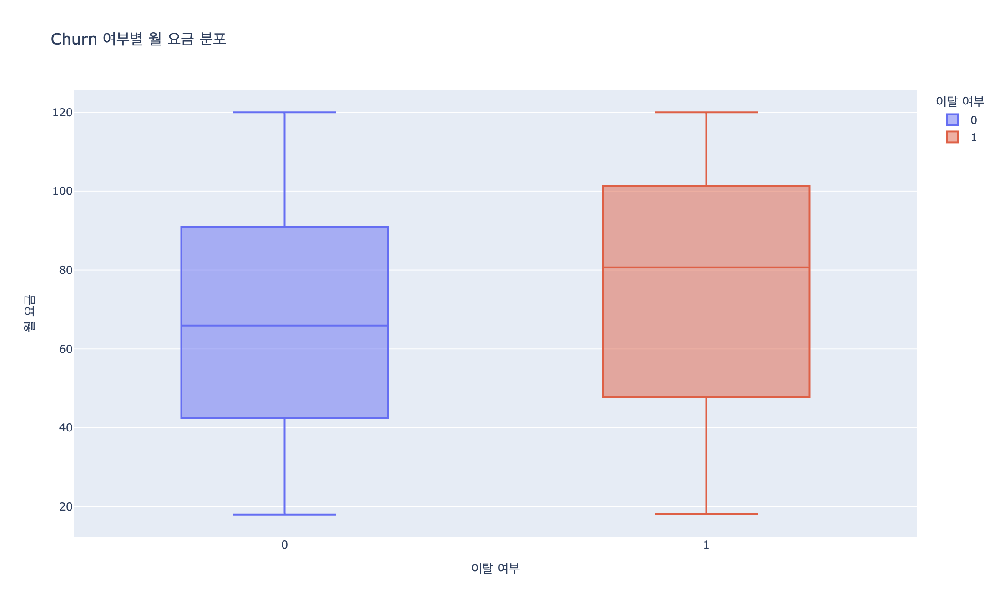
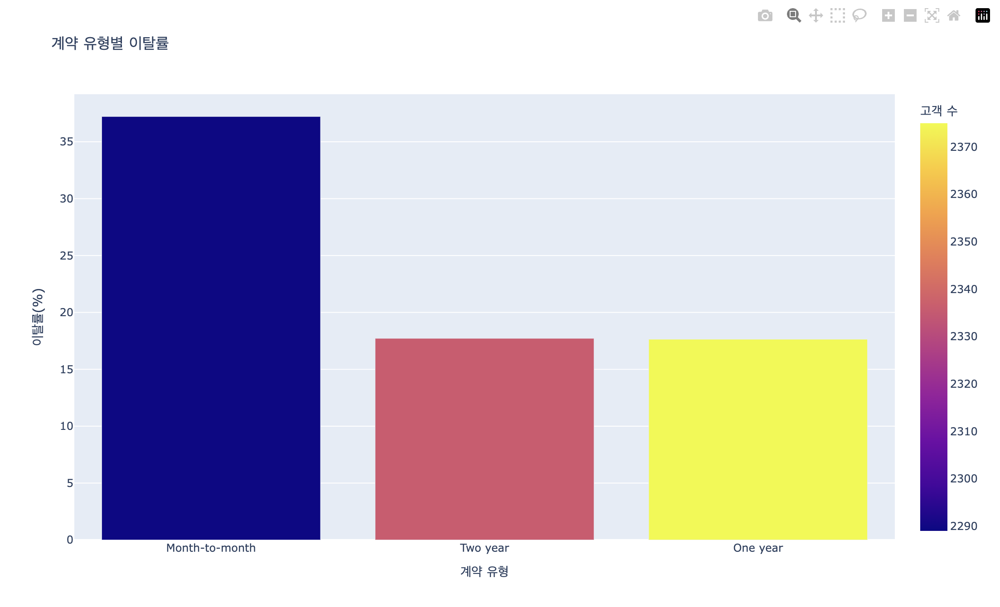
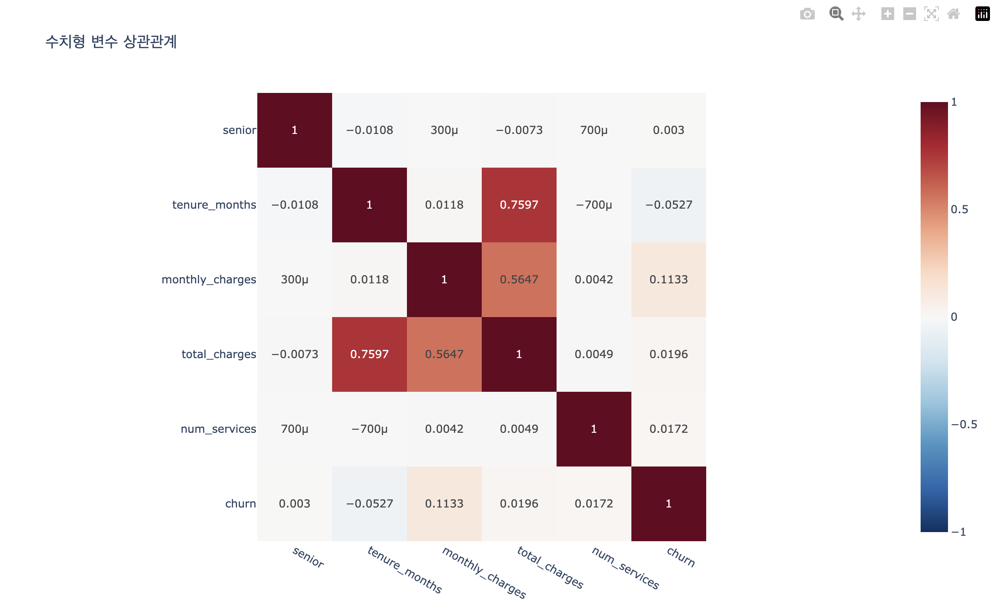

# Day2 종합실습 2 - EDA + 통계 + ML 파이프라인

수행 날짜: 2026-07-22  
작성자: 4기 광주 3반 정다운  
최종 제출 파일: `analysis.py`  
사용 데이터: `telco_churn.csv`

## 1. 실습 개요

`telco_churn.csv` 고객 이탈 데이터를 사용해 EDA, 시각화, 통계 검정, 머신러닝 파이프라인을 하나의 분석 흐름으로 수행했습니다.

외부 데이터를 그대로 신뢰하지 않고 결측치와 분포를 먼저 확인한 뒤, 통계적으로 의미 있는 차이를 검정하고, `sklearn.pipeline.Pipeline`으로 전처리와 모델 학습을 함께 구성했습니다.

## 2. 사용 데이터

| 항목 | 내용 |
| --- | --- |
| 입력 파일 | `../data/telco_churn.csv` |
| 데이터 규모 | 7,000행 |
| 목표 변수 | `churn` |
| 주요 수치형 변수 | `senior`, `tenure_months`, `monthly_charges`, `total_charges`, `num_services` |
| 주요 범주형 변수 | `gender`, `contract`, `payment_method` |
| 출력 폴더 | `output/` |

## 3. 수행 내용

1. Polars로 데이터 로딩 및 기본 EDA 수행
2. 결측치, 이탈 비율, 이탈 그룹별 평균 요약 출력
3. Plotly로 인터랙티브 시각화 3종 저장
4. `monthly_charges` 기준 이탈/비이탈 그룹 Welch t-test 수행
5. `contract`와 `churn` 카이제곱 검정 수행
6. `ColumnTransformer`로 수치형·범주형 전처리 분리
7. `Pipeline`으로 전처리와 RandomForest 모델을 하나로 구성
8. 정확도, F1-score, ROC-AUC, classification report 출력
9. `joblib`으로 모델 저장 후 재로딩 검증

## 4. 시각화 산출물

| 파일 | 내용 |
| --- | --- |
| `output/churn_charges.html` | 이탈 여부별 월 요금 분포 |
| `output/contract_churn_rate.html` | 계약 유형별 이탈률 |
| `output/numeric_correlation.html` | 수치형 변수 상관관계 |

시각화 결과 캡처:

## 5. 통계 분석 결과

| 검정 | 대상 | p-value | 해석 |
| --- | --- | ---: | --- |
| Welch t-test | `monthly_charges` by `churn` | 1.23e-20 | 이탈 여부별 월 요금 평균 차이가 통계적으로 유의 |
| Chi-square | `contract` x `churn` | 1.32e-70 | 계약 유형과 이탈 여부 사이의 연관이 통계적으로 유의 |

통계 검정은 연관성 확인입니다. 인과관계를 증명하는 결과는 아닙니다.

## 6. ML Pipeline 결과

| 항목 | 결과 |
| --- | ---: |
| Accuracy | 0.6400 |
| F1-score | 0.4412 |
| ROC-AUC | 0.6727 |
| 재로딩 후 ROC-AUC | 0.6727 |
| 모델 파일 | `output/churn_model.joblib` |
| 요약 파일 | `output/analysis_summary.json` |

`train_test_split`에는 `stratify=y`를 적용했습니다. 전처리는 train/test 분리 후 `Pipeline` 안에서 수행되므로 데이터 누수를 줄일 수 있습니다.

## 7. 성공 판정 기준 확인

| 기준 | 결과 |
| --- | --- |
| Polars EDA 수행 | 통과 |
| Plotly HTML 차트 저장 | 통과 |
| t-test와 p-value 해석 출력 | 통과 |
| 카이제곱 검정 수행 | 통과 |
| Pipeline 객체로 전처리와 모델 구성 | 통과 |
| 정확도, F1, ROC-AUC 출력 | 통과 |
| `joblib` 모델 저장 및 재로딩 확인 | 통과 |

## 8. 정리

이번 실습에서는 EDA부터 통계 검정, ML Pipeline, 모델 저장까지 연결된 분석 흐름을 수행했습니다.

아쉬운 점은 모델 튜닝을 깊게 하지 않았다는 점입니다. 추가로 GridSearchCV, 교차 검증, PR-AUC, feature importance, SHAP 기반 해석을 적용하면 분석 완성도를 더 높이고 싶습니다.
