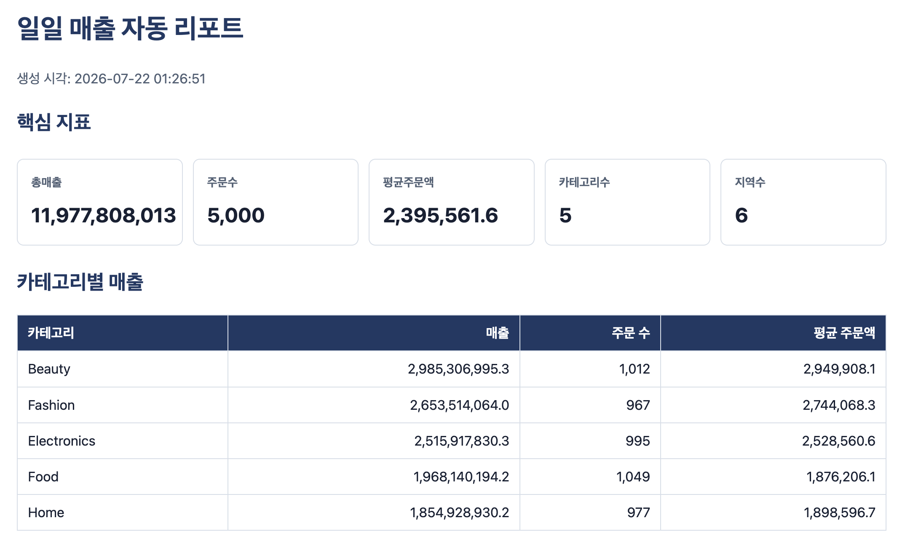
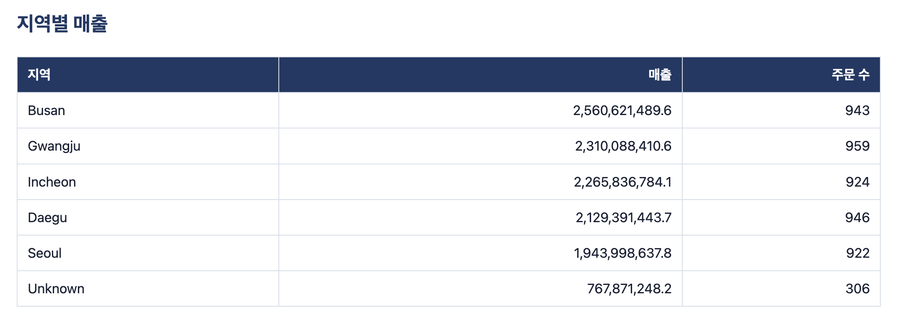
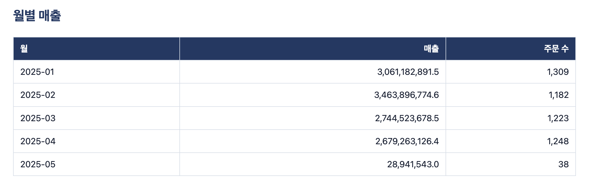
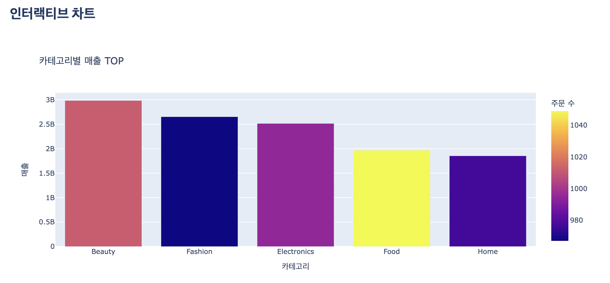

# Day2 종합실습 3 - 분석 자동화, 리포트 생성

수행 날짜: 2026-07-22  
작성자: 4기 광주 3반 정다운  
주요 파일: `config.py`, `report.py`, `run_scheduler.py`  
사용 데이터: `sales_raw.csv`

## 1. 실습 개요

`sales_raw.csv` 주문 데이터를 자동으로 정제, 집계, HTML 리포트로 생성하는 분석 자동화 실습입니다.

설정값은 `config.py`의 frozen dataclass로 분리했고, `report.py`의 `run_once()`가 로딩부터 리포트 저장까지 한 번의 실행 흐름을 담당하도록 구성했습니다.

## 2. 폴더 구조

| 파일 | 역할 |
| --- | --- |
| `config.py` | 데이터 경로, 출력 경로, 템플릿 경로 설정 |
| `report.py` | 데이터 로딩, 정제, 집계, HTML 렌더링 |
| `run_scheduler.py` | 1회 실행 또는 반복 실행 진입점 |
| `templates/report.html` | Jinja2 HTML 리포트 템플릿 |
| `output/` | timestamp 기반 HTML 리포트 저장 |

## 3. 수행 내용

1. `Config` dataclass로 설정값 분리
2. sales 데이터 로딩 후 타입 변환과 결측 처리
3. 카테고리별 중앙값으로 `unit_price` 결측 대체
4. 지역 결측은 `Unknown`으로 처리
5. KPI, 카테고리별 매출, 지역별 매출, 월별 매출 집계
6. Plotly 카테고리 매출 차트를 HTML에 삽입
7. Jinja2 템플릿으로 timestamp 포함 HTML 리포트 생성
8. `run_scheduler.py`로 1회 실행, 단순 loop, schedule 방식 반복 실행 지원

## 4. 실행 방법

1회 리포트 생성:

```bash
uv run python 'Python_data_0721_Day2/Total 3/report.py'
```

스케줄러 1회 실행:

```bash
uv run python 'Python_data_0721_Day2/Total 3/run_scheduler.py'
```

10초 간격 반복 실행:

```bash
uv run python 'Python_data_0721_Day2/Total 3/run_scheduler.py' --interval 10 --mode schedule
```

## 5. 산출물

| 항목 | 내용 |
| --- | --- |
| 리포트 파일 | `output/report_YYYYMMDD_HHMMSS.html` |
| 리포트 내용 | KPI, 카테고리별 매출, 지역별 매출, 월별 매출, Plotly 차트 |
| 템플릿 | `templates/report.html` |

리포트 결과 캡처:







## 6. 핵심 구현

### `run_once()`

`run_once()`는 자동화의 공통 실행 단위입니다. CLI 직접 실행, loop 방식, schedule 방식 모두 같은 함수를 사용하므로 실행 방식이 달라도 결과 생성 로직이 중복되지 않습니다.

### Timestamp 리포트

고정 파일명으로 덮어쓰지 않고 `report_YYYYMMDD_HHMMSS.html` 형식으로 저장했습니다. 이전 실행 결과를 보존하기 위한 구조입니다.

### Jinja2 템플릿

문자열을 코드 안에서 직접 이어 붙이지 않고 HTML 템플릿을 분리했습니다. 리포트 디자인과 데이터 생성 로직을 따로 수정할 수 있습니다.

## 7. 성공 판정 기준 확인

| 기준 | 결과 |
| --- | --- |
| `config.py` 설정 분리 | 통과 |
| frozen dataclass 사용 | 통과 |
| HTML 리포트 자동 생성 | 통과 |
| KPI와 집계 테이블 포함 | 통과 |
| Plotly 차트 삽입 | 통과 |
| timestamp 기반 파일명 | 통과 |
| loop/schedule 실행 구조 | 통과 |

## 8. 정리

이번 실습에서는 분석 코드를 한 번 실행하고 끝내는 방식에서 벗어나, 반복 실행 가능한 자동 리포트 구조를 만드는 것을 수행했습니다.

아쉬운 점은 알림 발송과 실패 재시도 처리가 아직 없다는 점입니다. 추가로 이메일, Slack 알림, 오류 로그 저장, 실패 시 재시도 정책을 붙이면 실제 운영형 리포트에 더 가까워질 것 같습니다.
