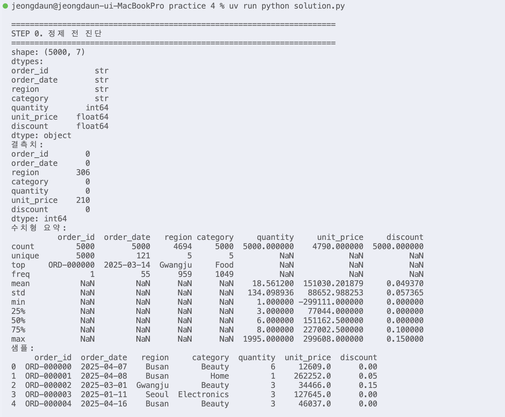
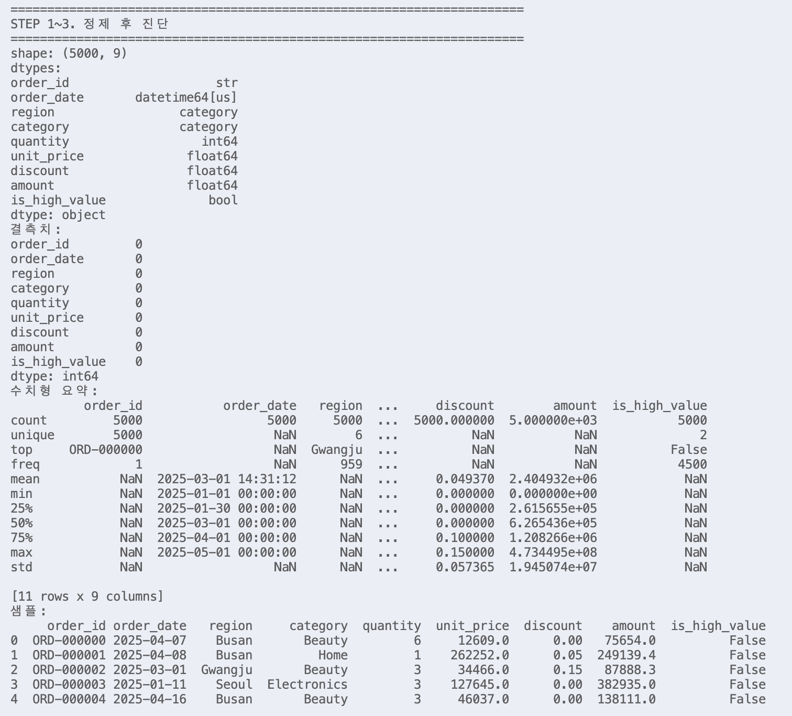
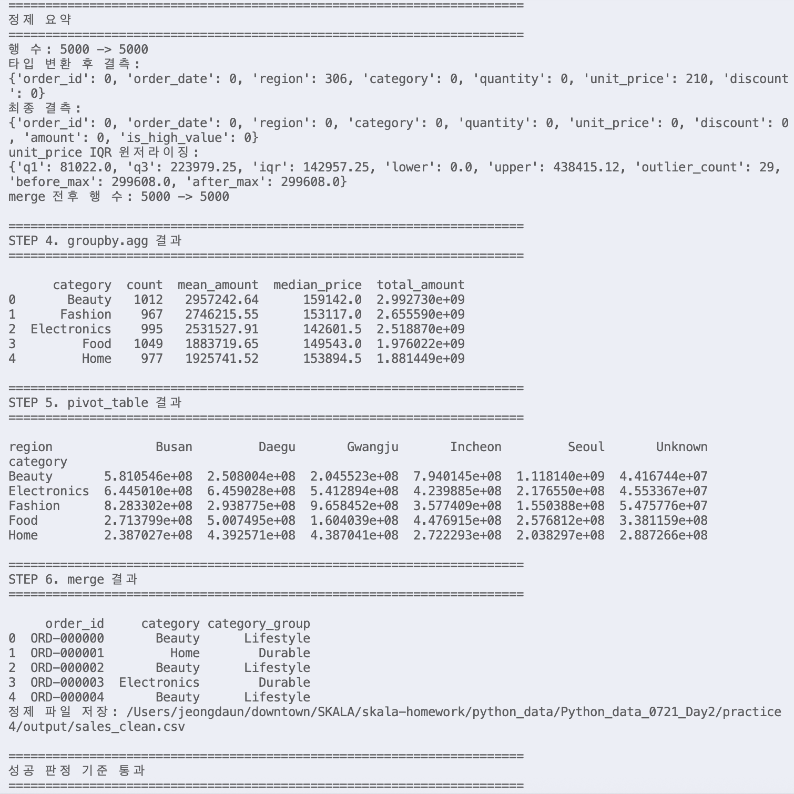

# Day2 실습 4 - Pandas 2.x 데이터 정제

수행 날짜: 2026-07-22  
작성자: 4기 광주 3반 정다운  
최종 제출 파일: `solution.py`  
사용 데이터: `sales_raw.csv`

## 1. 실습 개요

`sales_raw.csv` 5,000건 주문 데이터를 Pandas로 로딩한 뒤 결측치, 타입 불일치, 이상치 후보를 정제하는 실습입니다.

정제 후 `groupby.agg`, `pivot_table`, `merge`를 사용해 분석용 요약 결과를 만들고, 최종 정제 파일을 `output/sales_clean.csv`로 저장했습니다.

## 2. 사용 데이터

| 항목 | 내용 |
| --- | --- |
| 입력 파일 | `../data/sales_raw.csv` |
| 데이터 규모 | 5,000행 |
| 주요 컬럼 | `order_id`, `order_date`, `region`, `category`, `quantity`, `unit_price`, `discount` |
| 출력 파일 | `output/sales_clean.csv` |

## 3. 수행 내용

1. `df.info()`, `isna().sum()`, `describe()`로 정제 전 데이터 진단
2. 날짜, 수량, 가격, 할인율 컬럼 타입 정규화
3. `unit_price` 결측치는 `category`별 중앙값으로 대체
4. `region` 결측치는 임의 지역 추정 대신 `Unknown` 범주로 보존
5. IQR 방식으로 `unit_price` 이상치 후보 윈저라이징
6. `amount` 파생 컬럼 생성
7. `groupby.agg` named aggregation으로 카테고리별 매출 요약
8. `pivot_table`로 카테고리와 지역 기준 매출 피벗 생성
9. 카테고리 설명 테이블을 `merge`하고 병합 전후 행 수 검증

## 4. 핵심 구현

### 결측치 처리

가격 결측치를 0으로 채우면 실제 매출이 왜곡됩니다. 따라서 같은 `category` 안에서 계산한 중앙값으로 대체했습니다.

지역 결측치는 주변 평균으로 채울 수 있는 수치형 데이터가 아니므로 `Unknown`으로 보존했습니다. 결측 행 삭제보다 데이터 손실이 적고, 이후 분석에서 미상 지역을 별도 범주로 확인할 수 있습니다.

### IQR 윈저라이징

IQR 기준은 다음 공식으로 계산했습니다.

```text
Q1 = 1사분위수
Q3 = 3사분위수
IQR = Q3 - Q1
하한 = Q1 - 1.5 * IQR
상한 = Q3 + 1.5 * IQR
```

`unit_price`는 음수가 될 수 없는 값이므로 하한을 0 이상으로 보정했습니다. 행 삭제 대신 상한과 하한으로 값을 제한해 주문 데이터 자체는 보존했습니다.

### Named Aggregation

`agg({"amount": "sum"})` 방식 대신 다음처럼 결과 컬럼명을 명시했습니다.

```python
.agg(
    count=("amount", "count"),
    mean_amount=("amount", "mean"),
    median_price=("unit_price", "median"),
    total_amount=("amount", "sum"),
)
```

## 5. 실행 결과

실행 명령:

```bash
uv run python 'Python_data_0721_Day2/practice 4/solution.py'
```

주요 결과:

| 항목 | 결과 |
| --- | --- |
| 정제 전 행 수 | 5,000 |
| 정제 후 행 수 | 5,000 |
| 결측치 | 최종 0개 |
| 이상치 처리 | `unit_price` IQR 윈저라이징 |
| 저장 파일 | `output/sales_clean.csv` |

실행 결과 캡처:






## 6. 성공 판정 기준 확인

| 기준 | 결과 |
| --- | --- |
| `df.info()`, `isnull().sum()` 출력 | 통과 |
| IQR 공식 적용 | 통과 |
| 제거 전후 행 수 출력 | 통과 |
| named aggregation 사용 | 통과 |
| 총매출 내림차순 정렬 | 통과 |
| `pivot_table`, `merge` 수행 | 통과 |
| 최종 정제 파일 저장 | 통과 |

## 7. 정리

이번 실습에서는 Pandas로 데이터 타입을 먼저 정규화한 뒤 결측치와 이상치를 처리하는 흐름을 수행했습니다.

아쉬운 점은 `unit_price` 중심의 이상치 처리만 수행했다는 점입니다. 추가로 `discount` 범위 검증, 주문 수량 이상치 검증, 결측 처리 방식별 매출 변화 비교를 더 해보고 싶습니다. 