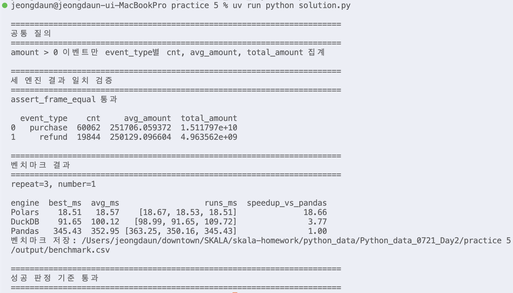

# Day2 실습 5 - Polars DuckDB 성능 비교

수행 날짜: 2026-07-22  
작성자: 4기 광주 3반 정다운  
최종 제출 파일: `solution.py`  
사용 데이터: `events_large.csv`

## 1. 실습 개요

`events_large.csv` 1,000,000건 이벤트 데이터를 Pandas, Polars, DuckDB로 각각 처리하고 동일한 집계 결과와 실행 시간을 비교하는 실습입니다.

같은 질의를 세 도구로 구현한 뒤 결과가 같은지 검증하고, `timeit.repeat()`으로 동일 반복 횟수 기준 실행 시간을 측정했습니다.

## 2. 사용 데이터

| 항목 | 내용 |
| --- | --- |
| 입력 파일 | `../data/events_large.csv` |
| 데이터 규모 | 1,000,000행 |
| 주요 컬럼 | `event_id`, `user_id`, `event_type`, `ts`, `amount` |
| 결과 파일 | `output/engine_result.csv` |
| 벤치마크 파일 | `output/benchmark.csv` |

## 3. 공통 질의

세 엔진 모두 다음 조건과 집계를 동일하게 수행했습니다.

```text
amount > 0 이벤트만 선택
event_type별 cnt, avg_amount, total_amount 계산
cnt 기준 내림차순 정렬
```

## 4. 수행 내용

1. Pandas `read_csv`와 `groupby.agg`로 기준 집계 작성
2. Polars `scan_csv` 기반 Lazy API 체인 작성
3. DuckDB SQL로 CSV 파일 직접 조회
4. 결과 정렬과 타입 보정 후 `assert_frame_equal`로 결과 일치 검증
5. `timeit.repeat()`으로 Pandas, Polars, DuckDB 실행 시간 측정
6. 동일 반복 횟수 `repeat=3`, `number=1` 적용
7. 벤치마크 결과를 CSV로 저장

## 5. 핵심 구현

### Polars Lazy API

Polars는 `read_csv`가 아니라 `scan_csv`를 사용했습니다. LazyFrame 상태로 질의를 구성한 뒤 마지막에 `.collect()`를 호출해 실제 계산을 실행했습니다.

```python
pl.scan_csv(DATA_PATH)
    .filter(pl.col("amount") > 0)
    .group_by("event_type")
    .agg(...)
    .sort("cnt", descending=True)
    .collect()
```

### DuckDB SQL

DuckDB는 DataFrame을 미리 만들지 않고 CSV 파일을 SQL에서 직접 조회했습니다. SQL에 익숙한 분석자가 같은 로직을 빠르게 확인하기 좋은 방식입니다.

### 결과 검증

엔진마다 정렬 순서나 dtype이 다를 수 있으므로 비교 전 컬럼 순서와 정렬 기준을 통일했습니다.

## 6. 실행 결과

실행 명령:

```bash
uv run python 'Python_data_0721_Day2/practice 5/solution.py'
```

벤치마크 결과 예시:

| 엔진 | best_ms | avg_ms | Pandas 대비 |
| --- | ---: | ---: | ---: |
| Polars | 18.51 | 18.57 | 18.66배 |
| DuckDB | 91.65 | 100.12 | 3.77배 |
| Pandas | 345.43 | 352.95 | 1.00배 |

실행 시간은 CPU 상태, 백그라운드 작업, 디스크 캐시 영향으로 실행할 때마다 조금씩 달라질 수 있습니다. 따라서 핵심은 세 엔진의 결과가 동일하게 검증되고, 동일한 `repeat=3`, `number=1` 조건으로 비교했다는 점입니다.

실행 결과 캡처:



## 7. 성공 판정 기준 확인

| 기준 | 결과 |
| --- | --- |
| Pandas, Polars, DuckDB 모두 사용 | 통과 |
| Polars `scan_csv` 사용 | 통과 |
| Polars `.collect()` 호출 | 통과 |
| 세 엔진 결과 일치 검증 | 통과 |
| `timeit` 반복 횟수 통일 | 통과 |
| 벤치마크 결과 출력 | 통과 |

## 8. 정리

이번 실습에서는 같은 집계라도 처리 엔진에 따라 실행 시간이 크게 달라질 수 있음을 확인했습니다.

아쉬운 점은 단일 질의만 비교했다는 점입니다. 추가로 조인, 시간대 집계, 다중 필터, 윈도우 함수까지 포함해 비교하면 도구별 장단점을 더 명확하게 볼 수 있을 것 같습니다. 
